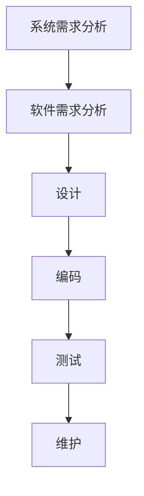

# 软件工程

## 软件工程四个关键元素

- 方法(Methodologies)
	- 提供如何构造软件的技术
- 语言(Language
	- 用于支持软件的分析、设计和实现
- 工具(Tools)
	- 为方法和语言提供自动化或半自动化的支持
- 过程(Procedures)
	- 黏结剂，把方法、语言和工具黏结在一起，使得计算机软件开发理性化
		- 定义了方法使用的顺序、可交付的产品、方案和文档的规范格式

## 软件工程模型

### 瀑布模型

### 原型模型

### 螺旋模型

### 面向对象生存期模型

### 
