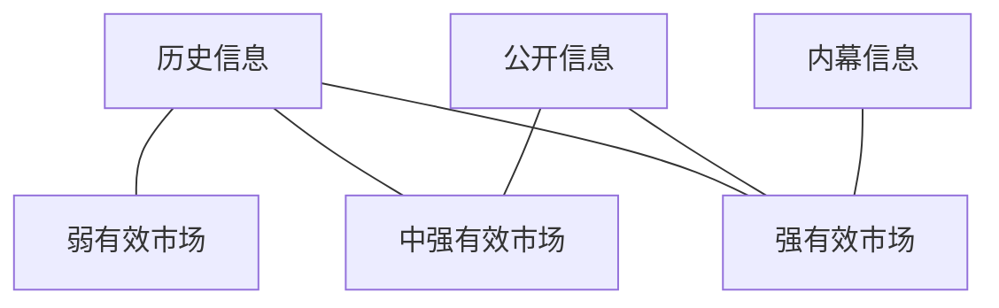

#金融学原理

## 第七章

### 有效市场假说

```mermaid
graph TB
	历史信息---弱有效市场
	历史信息---中强有效市场
	历史信息---强有效市场
	公开信息---中强有效市场
	公开信息---强有效市场
	内幕信息---强有效市场
```
### 大数据+金融

```mermaid
graph LR
	金融相关图片/音频--计算机视觉/语音识别-->非结构化信息
	subgraph 
	非结构化信息--去除噪声-->特征提取
	end

```
