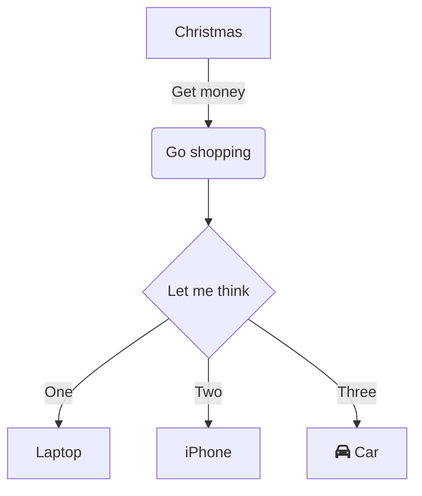
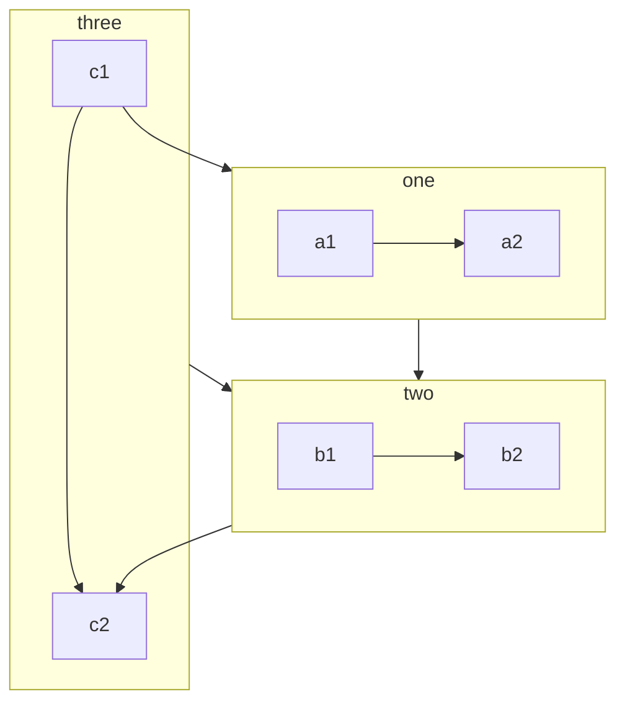
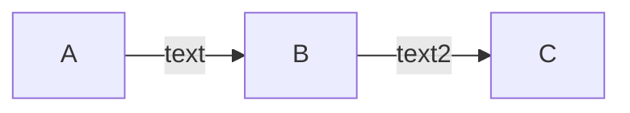
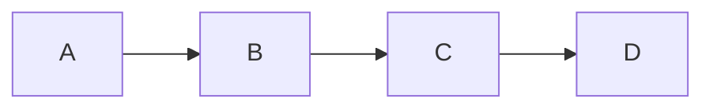
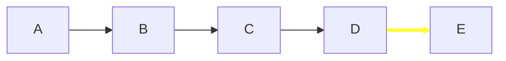
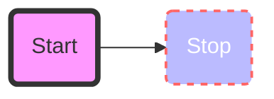
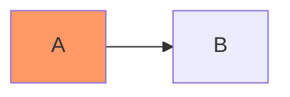

## mermaid 画流程图

### 案例

[官网](https://mermaid-js.github.io/mermaid/#/flowchart?id=a-node-in-a-cylindrical-shape)的实例：



```code
graph TD
    A[Christmas] -->|Get money| B(Go shopping)
    B --> C{Let me think}
    C -->|One| D[Laptop]
    C -->|Two| E[iPhone]
    C -->|Three| F[fa:fa-car Car]
```

- `graph` 支持参数
  - `TB` 或 `TD` ：代表节点按照从上到下排列；
  - `BT` ：代表节点按照从下到上排列；
  - `LR` ：代表节点按照从左到右排列；
  - `RL` ：代表节点按照从右到左排列；
- node 形状：
  - `node_id[text]` ：定义方形的节点；
  - `node_id(text)` ：定义圆角的节点；
  - `node_id([text])` ：定义体育场形的节点；
  - `node_id[[text]]` ：定义子程序形状的节点；
  - `node_id[(text)]` ：定义圆柱形的节点；
  - `node_id((text))` ：定义圆形的阶段；
  - `node_id>text]` ：定义不对称形状的节点；
  - `node_id{text}` ：定义菱形的节点；
  - `node_id{{text}}` ：定义六边形节点；
  - `node_id[/text/]` ：定义平行四边形节点（ `/` 反过来就可以将四边形翻过来）；
  - `node_id[\text/]` ：定义梯形节点（斜杠和反斜杠反过来，整个梯形就反过来了）；
- link 形状：
  - `node_id1---node_id2` ：直连；
  - `node_id1-->node_id2` ：带箭头直线；
  - `node_id1===node_id2` ：加粗直线（可以带箭头）；
  - `node_id1-.-node_id2` ：虚线（可以带箭头）；
    - `node_id1 -text- node_id2` 或 `node_id1 ---|text| node_id2` ：箭头中间可以带文本；

### 子图



```code
flowchart TB
    c1-->a2
    subgraph one
    a1-->a2
    end
    subgraph two
    b1-->b2
    end
    subgraph three
    c1-->c2
    end
    one --> two
    three --> two
    two --> c2
```

### 注释



```code
graph LR
%% this is a comment A -- text --> B{node}
   A -- text --> B -- text2 --> C
```

### 交互

可以为 node 绑定事件，使得流程图可以交互；



```code
graph LR;
    A-->B;
    B-->C;
    C-->D;
    click B "http://www.github.com"
    click D href "http://www.github.com"
```

### 自定义样式

#### 线条样式自定义



```code
graph LR
    A --> B;
    B --> C;
    C --> D;
    D --> E;
    linkStyle 3 stroke:#ff3,stroke-width:4px;
```

由于 link 不像 node 拥有 id 所以 mermaid 使用序号为 link 附加样式。例如上面的代码就是对第 4 个 link 赋予样式。

#### 节点样式自定义



```code
graph LR
    id1(Start)-->id2(Stop)
    style id1 fill:#f9f,stroke:#333,stroke-width:4px
    style id2 fill:#bbf,stroke:#f66,stroke-width:2px,color:#fff,stroke-dasharray: 5 5
```

##### 自定义类

实际使用的时候更多会将样式定义为类，然后将类赋予节点来定义样式。避免了为每一个类都定义一个样式的麻烦。



```code
graph LR
    A:::someclass --> B
    classDef someclass fill:#f96;
```
