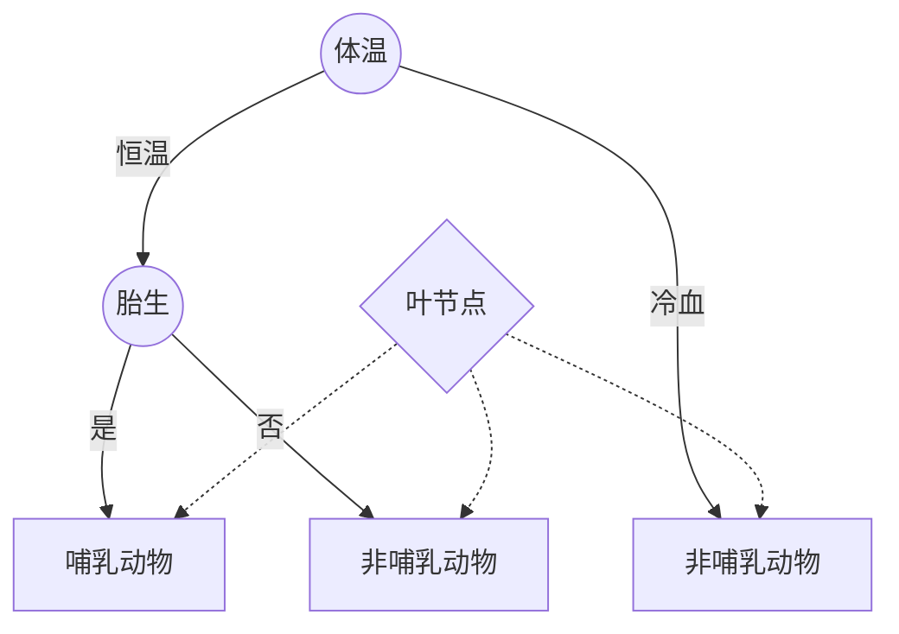
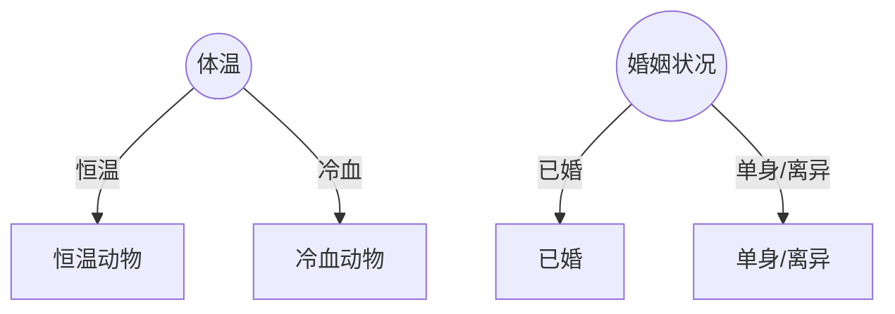

## 第四章 分类：基本概念、决策树与模型评估

### 分类的基本概念

**分类**：分类任务就是通过学习得到一个目标函数（target function)$f$，把每个属性集$x$映射到一个预先定义的类标号$y$。目标函数也称为**分类模型**(classification model)。

- 分类模型的意义：

  - 描述性建模
  > 分类模型可以作为解释性的工具，用于区分不同类中的对象。
  - 预测性建模
  > 用于预测未知记录的类标号。

**回归**：一种预测建模任务，目标属性$y$是连续的。

用图表表示分类模型的任务:

<div style='text-align: center'>


</div>

分类法的主要例子有：决策树分类法、基于规则的分类法、神经网络、支持向量机和朴素贝叶斯分类法。
它们都使用了一种**学习算法(learning algorithm)**。使用学习算法得到的模型不仅要很好地拟合数
据中类标号和属性集之间地关系，还要能够正确地预测未知样本地类标号。因此，训练算法地主要目的
就是建立具有很好**泛化**能力模型。

> **泛化(generalization)**
>
> 学得的模型预测新样本地能力。
>
> **训练集(training set)**
>
> 类标号已知的数据集，用来训练模型。
>
> **检验集(test set)**
>
> 由类标号未知的记录组成，用来检验模型拟合优劣。
>

#### 分类模型性能检验

> **混淆矩阵(confusion matrix)**
>
> 根据模型正确和错误预测的检测记录技术进行评估，这些计数存放在称作**混淆矩阵**的表格中。
> 正确预测:$f_{11} + f_{00}$,错误预测:$f_{10} + f_{01}$
>
> **性能度量(performance metric)**
>
> 度量分类算法优劣的量成为**性能度量**，比如：
>
> **准确率(accuracy)**：
> $$\frac{f_{11}+f_{00}}{f_{11}+f_{00}+f_{10}+f_{01}}$$
>
> **错误率(error rate)**：
> $$\frac{f_{01}+f_{10}}{f_{11}+f_{00}+f_{10}+f_{01}}$$
>

---

### 决策树

#### 决策树的工作原理

**决策树**  通过提出一系列精心构思的关于检验记录属性的问题，每提出一个问题得到答案，下一个问题将随之而来，直到得到类的标号为止。
这一系列的问题和可能的回答就组织成了决策树的形式。**决策树**是一种由**节点**和**有向边**组成的层次结构。

> **根节点(root node)**  它没有入边，但有零条或多条出边。
>
> **内部节点(internal node)** 恰有一条入边和两条或多条出边。
>
> **叶节点(leaf node**)或**终结点(terminal node)** 恰有一条蠕变，但没有出边。
>
> **非终结点(non-terminal node)** 包括根节点和内部节点，包含属性测试条件，用以翻开具有不同特性的记录。
>

<div style='text-align: center'>



e.g.：哺乳动物分类问题的决策树
</div>

#### 如何建立决策树

从原理来看，对于给定的属性集，我们可以构造的决策树数目达指数级。虽然有些决策树比其他的决策树更加准确有效，但是由于搜索空间达到了指数规模，所以找出最佳的决策树在计算中是不可行的。

但我们还是设计了一些有效的算法，能够在合理的时间内构造出具有一定准确率的次最优决策树。采用的策略通常是贪心策略。

##### 1. Hunt算法

1. 先将训练记录划分为较纯的子集；
2. 通过递归的方式建立决策树。设$D_t$是与节点$t$相关联的的训练记录集，而$y=\{y_1,y_2,...,y_c\}$是类标号。
   - 如果$D_t$中所有记录都属于同一个类$y_c$，则$t$是叶节点，用$y_t$标记；
   - 如果$D_t$中包含属于多个类的记录，则选择一个**属性测试条件(attribute test condition)**，将记录划分为较小的子集。对于测试条件的每个输出，创建一个子女节点，并根据测试结果将$D_t$中的记录分布到子女节点中。然后对于每个子女节点继续进行判断递归。

---

例子：

任务：根据历史贷款者的相关数据，预测怎样的贷款者会拖欠贷款。

| Tid | 有房者 | 婚姻状况 | 年收入 | 拖欠贷款者 |
| --- | ------ | -------- | ------ | ---------- |
| 1   | 是     | 单身     | 125K   | 否         |
| 2   | 否     | 已婚     | 100K   | 否         |
| 3   | 否     | 单身     | 70K    | 否         |
| 4   | 是     | 已婚     | 120K   | 否         |
| 5   | 否     | 离异     | 95K    | 是         |
| 6   | 是     | 已婚     | 60K    | 否         |
| 7   | 是     | 离异     | 220K   | 否         |
| 8   | 否     | 单身     | 85K    | 是         |
| 9   | 否     | 已婚     | 75K    | 否         |
| 10  | 否     | 单身     | 90K    | 是         |

第一次递归：
<div style='text-align: center'>

```mermaid
graph TB
	拖欠贷款者=否
```

</div>

第二次递归：
<div style='text-align: center'>

```mermaid
graph TB
	1((有房者))--是-->拖欠贷款者=否
	1((有房者))--否-->投钱贷款者=是
```

</div>

第三次递归：
<div style='text-align: center'>

```mermaid
graph TB
	1((有房者))--是-->2[拖欠贷款者=否]
	1((有房者))--否-->4((婚姻状况))
	4((婚姻状况))--单身离异-->拖欠贷款者=是
	4((婚姻状况))--已婚-->3[拖欠贷款者=否]
```

</div>
第四次递归：
<div style='text-align: center'>

```mermaid
graph TB
	1((有房者))--是-->4[拖欠贷款者=否]
	1((有房者))--否-->2((婚姻状况))
	2((婚姻状况))--单身离异-->3((年收入))
	3((年收入))-->|<80K|6[拖欠贷款者=否]
	3((年收入))-->|>80K|拖欠贷款者=是
	2((婚姻状况))--已婚-->5[拖欠贷款者=否]
```

</div>

---

我们还需要继续递归调用Hunt算法，直到所有的记录都属于同一个类为止。

如果属性值的每种组合都在训练数据中出现，并且每种组合都具有唯一的类标号，则Hunt算法是有效的。
但是实际情况并不如此，对于Hunt算法的第二步有可能没有与之匹配的集合。

附加条件：

1. 算法的第二步所创建的子女节点可能为空，即不存在与这些节点相关的记录。如果没有一个训练记录包含与这样的节点相关联的属性值组合（比如上例中，没有有房者的年收入小于80K)。这时，该节点成为叶节点，类标号为其父节点上训练记录的多数类。
2. 在第二步，如果与$D_t$相关联的所以记录都具有相同的属性值（目标属性除外），则不可能进一步划分这些记录。

#### 属性测试条件

决策树归纳算法必须为不同类型的属性提供检测方法和相应的输出。

- 离散属性

  - **二元属性** 二元属性有两个可能的输出。
  - **标称属性/序数属性** 都可以多路划分，或者通过属性值分组形成分组的二元划分。

例子：

<div style='text-align: center'>



</div>

- 连续属性

  - **连续属性** 连续属性可以通过区间划分从而实现二元划分和多路划分。不在距离赘述了。

### 选择最佳划分的度量

为了区别划分的优劣性，我们定义了**纯性**。纯性表示经过一轮选择划分之后，得到的子女节点的类单一程度。若经过划分之后，子女节点中只有一种类，那么纯性最高，不纯性最低。

选择最佳划分的度量通常是根据划分后子女节点不纯性的程度。不纯的程度越低，类的分布就越倾斜。

> **定义**
>
> $p(i|t)$表示给定节点 $t$ 中属于类 $i$ 的记录所占的比例，有时会省略 $t$，直接用 $p_i$ 表示。
> 不纯性的度量有多种方式，例如：  
> 熵：
> $$Entropy(t)=-\sum_{i=0}^{c-1}p(i|t)log_2p(i|t)$$
> 基尼系数：
> $$Gini(t)=1-\sum_{i=0}^{c-1}[p(i|t)]^2$$
> 分类错误：
> $$Classification \ error(t)=1-max_i[p(i|t)]$$
> 其中 $c$ 是类的个数，并且在计算熵时，$Olog_20=0$。

**测试条件效果测试：**
比较父节点的不纯度和子女节点的不纯度，差异越大，说明分类效果越好。
$$\Delta=I(parent)-\sum^k_{j=1}\frac{N(v_i)}{N}I(v_i)$$
其中，$I(.)$是选定的不纯度量，$N$是父节点记录总数，$k$是属性值的个数，$N(v_i)$是与子女节点$v_i$相关联的记录总数。

由于$I(parent)$是不变的，因此最大化测试条件的效果相当于最小化子女节点的不纯度的加权平均值。当选择熵(entropy)为不纯性度量时，熵的差值就为信息增益(information gain)$\Delta_{info}$。

**增益率：**
熵和Gini指标等不纯性度量对具有大量不同值的属性有利。对于具有大量不同值的属性，有可能在测试条件中产生大量的输出结果。对于这种情况我们给出两种解决策略：

1. 限制测试条件只能是二元划分；
2. 修改评估划分的标准，把属性测试条件产生的输出结果也考虑进去；

**增益率：**
$$Gain \ ratio=\frac{\Delta_{info}}{Split \ Info}$$
$$Split \ Info=-\sum^{k}_{i=1}P(v_i)log_2P(v_i)$$
$k$是划分的总数。

### 决策树归纳算法

---
决策树算法框架:

---

```code
TreeGrowth(E,F)
if stopping_cond(E,F) = true then
	leaf = createNode()
	leaf.label = Classify(E)
	return leaf
else
	root = createNode()
	root.test_cond = find_best_split(E,F)
	令 V={v|v是root.test_cond的一个可能的输出}
	for 每个v包含于V do
		Ev = {e|root.test_cond(e) = v 并且e包含于E}
		child = TreeGrowth(Ev,F)
		将child作为root的派生节点添加到树中，并将边(root->child)标记为v
	end for
end if
return root
```

createNode()建立新节点  
find_best_split()确定哪个属性为测试条件  
Classify()为叶节点确定类标号  
stopping_cond()检查所有记录是否为同一个类，决定是否终止决策树  
  
决策树建立完成之后，就可以进行**树剪枝(tree-pruning)**，以减小决策树的规模。  
决策树过大容易受到所谓的**过分拟合(overfitting)** 现象的影响。

### 模型的过分拟合

分类模型的误差：

1. 训练误差(training error)/再代入误差(resubstitution error)/表现误差(apparent error)
2. 泛化误差(generalization error)  
训练误差：在训练记录中的误分类样本比例
泛化误差：在未知样本上的期望误差

当决策树很小时，训练和检验误差都很大，这种情况成为**模型拟合不足(model underfitting)**，但是一旦决策树的规模变得太大，即使训练误差继续在降低，但是检验误差开始增大，这种现象称为**模型过分拟合(model overfitting)**。

因为训练样本中存在噪声，若决策树过分拟合，将训练样本中的噪声数据也拟合进去了，那么在预测未知样本的分类时，泛化误差就会相当大了。

**导致过分拟合的因素：**

1. 训练样本存在噪声；
2. 训练样本缺少代表性样本；
3. 对少量训练样本进行多重比较；

### 泛化误差的估计

1. 使用再代入误差估计(乐观估计)
2. 结合模型复杂度(悲观估计、最小描述长度原则)  

> 定义  **奥卡姆剃刀**
> 给定两个具有相同泛化误差的模型，我们选择交简单的模型。  
>
> **悲观误差估计(pessimistic error estimate)**
> $$e_g(T)=\frac{\sum^{k}_{i=1}[e(t_i)+\Omega (t_i)]}{\sum^k_{i=1}n(t_i)}=\frac{e(T)+\Omega(T)}{N_t}$$  
> $k$是决策树的叶节点数，$e(T)$是决策树的总训练误差，$N_t$是训练记录数，$\Omega(t_i)$是每个节点$t_i$对应的罚项。  
> 即，该估计方法为训练误差和模型复杂度罚项的和。  
>
> **最小描述长度原则(minimum description length, MDL)**
>
> 该方法基于称为最小描述长度的(DML)的信息论方法。
> 传输的总花费：
> $$Cost(Modle,data)=Cost(modle)+Cost(data|modle)$$
> 右边的第一项是模型编码的开销，右边第二项是误分类记录编码的开销。
