作业任务：按照课件提示，在WOS数据库检索金融科技ABCD（人工智能、区块链、云计算、大数据）的文章，记录高引、高热点论文及领军人物。

* 金融科技+人工智能

  * 高被引

    

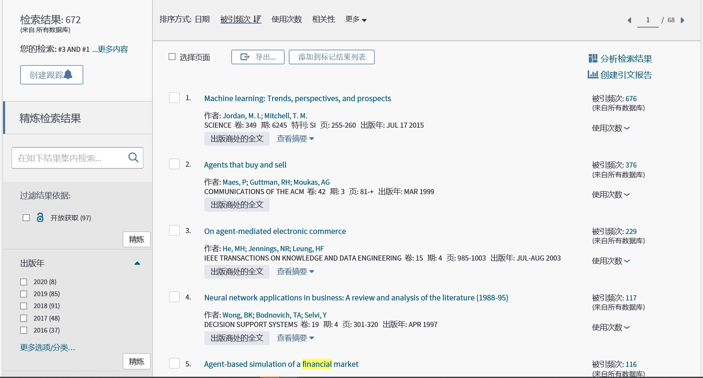

    

    - 高热

    

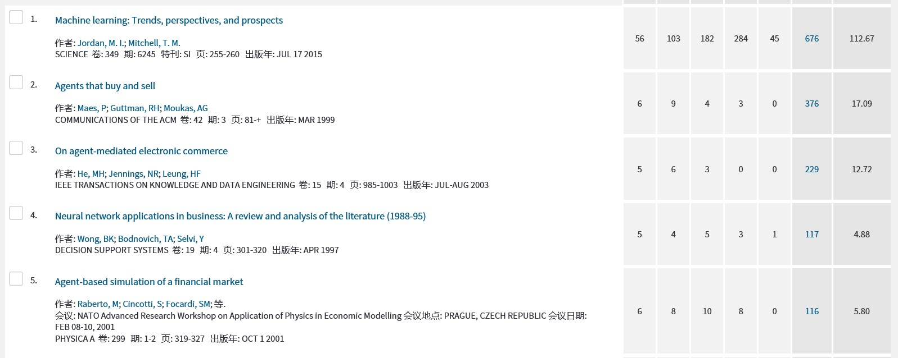

    

    

    - 领军人物

    

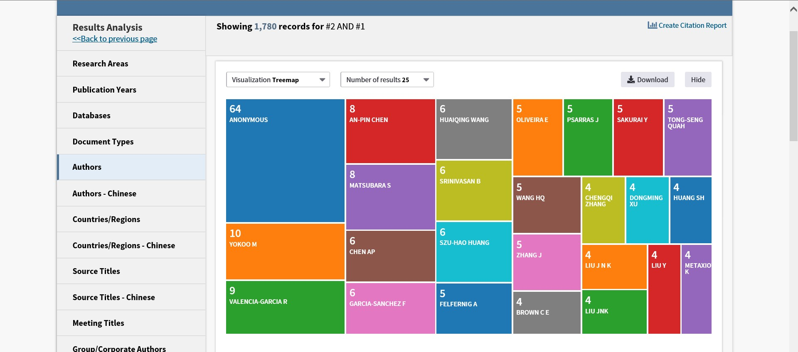

    

* 金融科技+区块链

  * 高被引

    

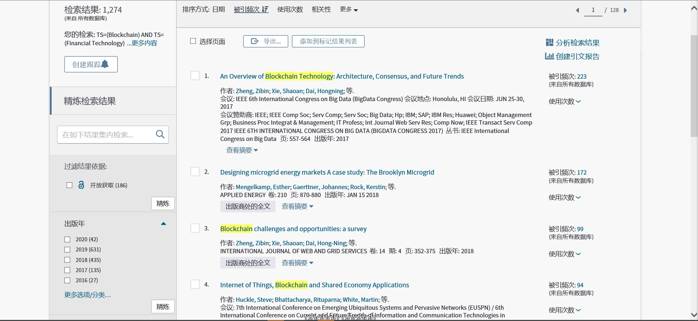

    

    - 高热

    

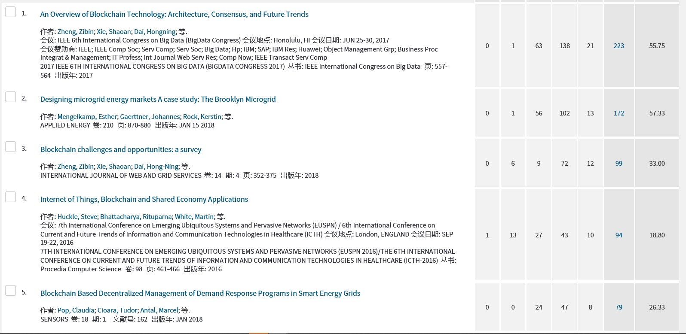

    

    - 领军人物

    

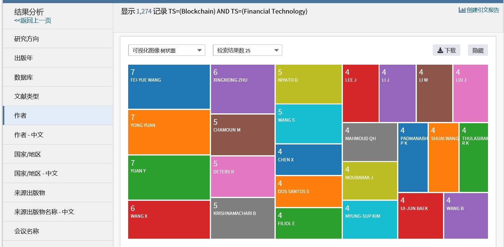

    

* 金融科技+云计算

  * 高被引

    

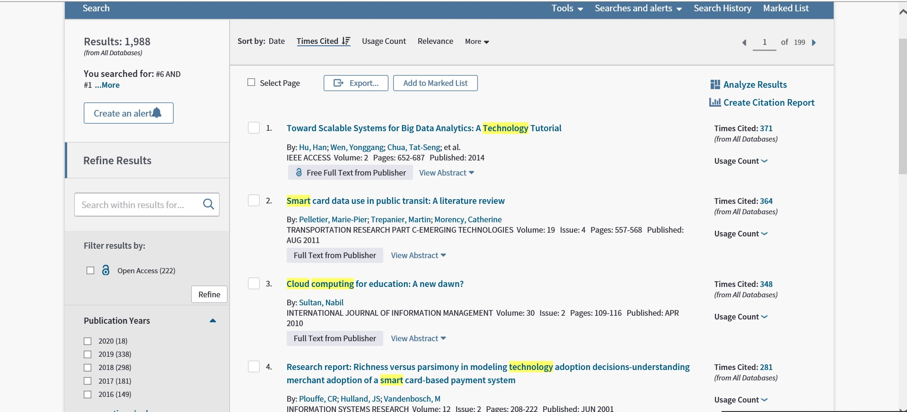

    

    - 高热

    

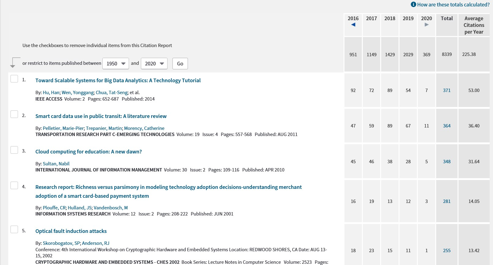

    

    

    - 领军人物

    

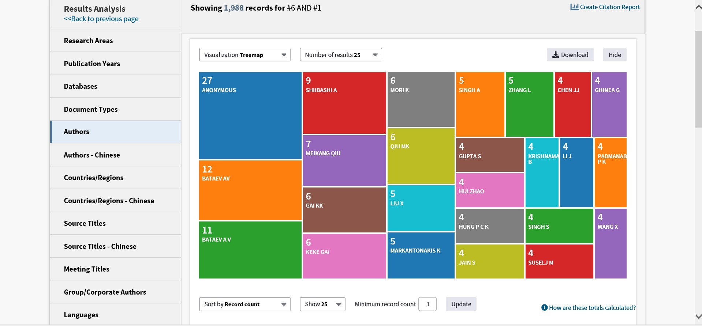

    

* 金融科技+大数据

  * 高被引

    

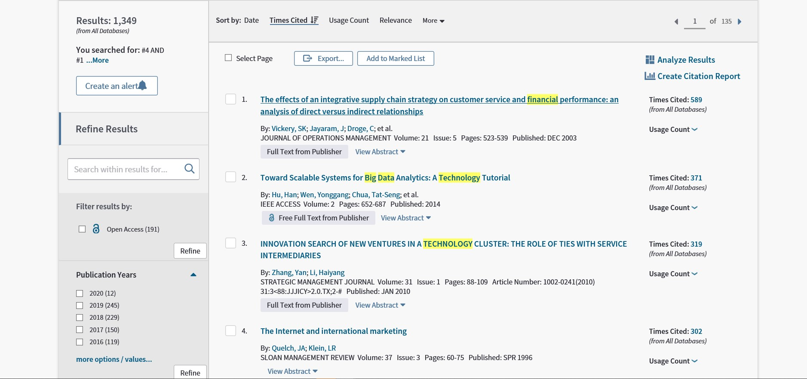

    

    - 高热

    

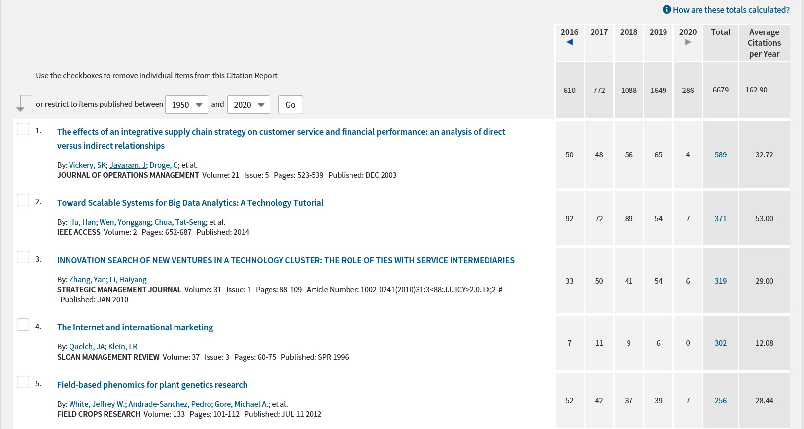

    

    - 领军人物

    

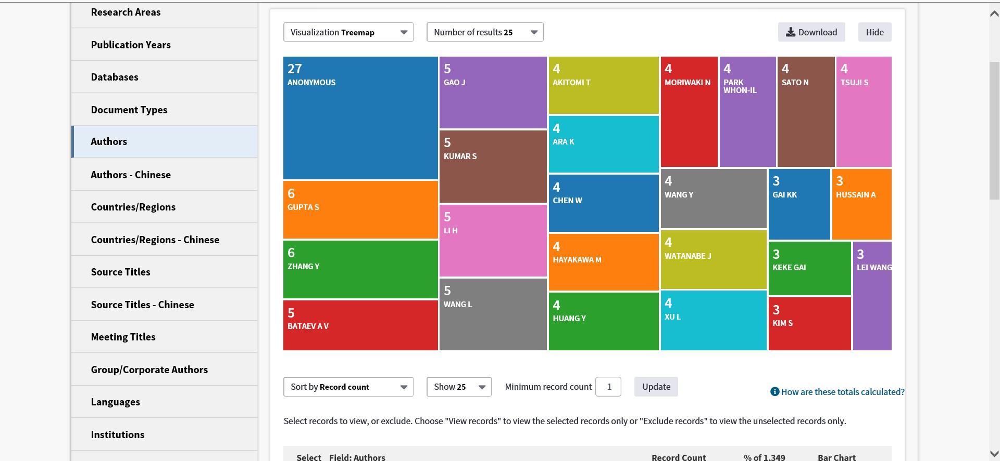

    

