按照课件提示，统计经济研究、金融研究、管理世界、中国工业经济任选一本杂志的量化指标，包括但不限于影响因子、即时指数、被引半衰期。
其中，

1. 影响因子可以通过出版来源导航直接查到最新一年的复合影响因子（cnki 首页的出版物检索链接进去）
2. 影响因子历史数据、即时指数、被引半衰期，可以通过中国引文数据库（cnki 首页的引文检索链接进去），只要求做 2019 一年的影响因子（直接查下来）、即时指数（查询 2019 的发文量，以及 2019 年的被引用量）、被引半衰期（逐年查询被引用的数量，达到全部被引数量的 50%）

备注：施引半衰期、热点词差异、作者差异、引用差异等通过导出参考文献用 Python 读取后做（可以作为实验内容或者课程考核），这些以后再说，本次作业暂不做要求。

- 经济研究+复合影响因子

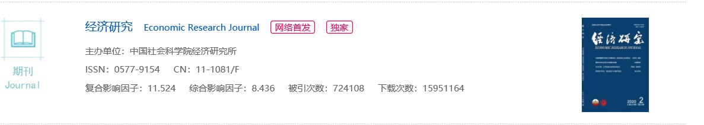

- 经济研究+即时指数

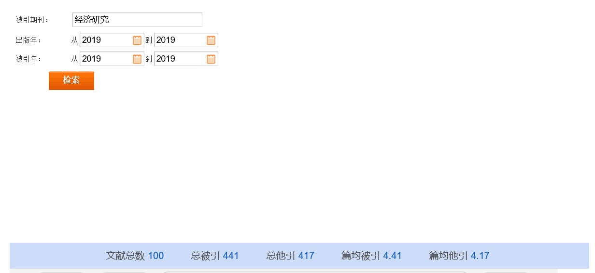

经济研究即时指数：441/100 = 4.41

- 经济研究+被引半衰期

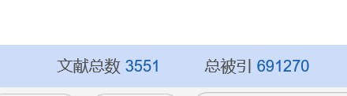

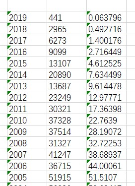

计算得：经济研究的被引半衰期为 14 + (50 - 44)/(51.51 - 44) = 14.80 年

- 金融研究+复合影响因子

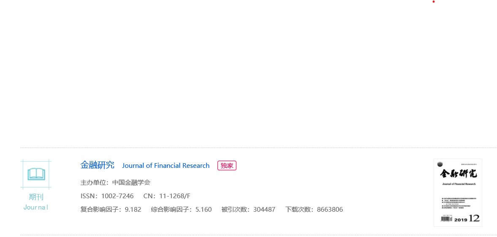

- 金融研究+即时指数

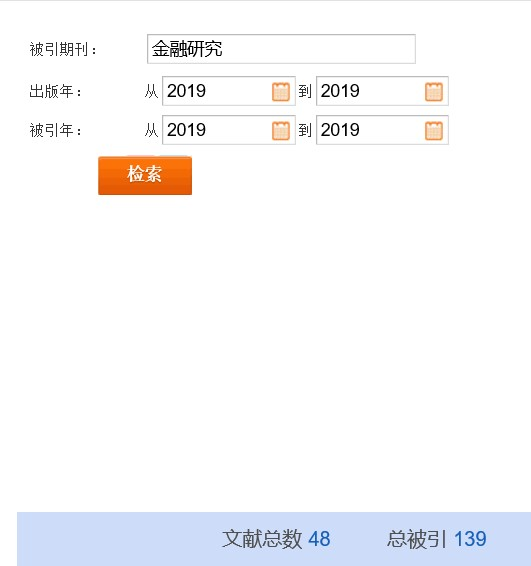

金融研究即时指数：139/48 = 2.90

- 金融研究+被引半衰期

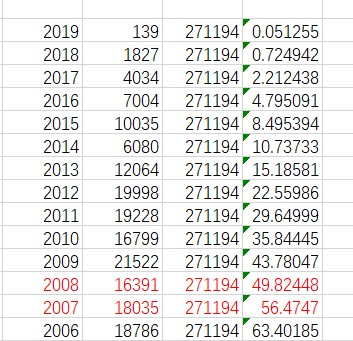

计算得：金融研究的被引半衰期为 12 + (50 - 49.82)/(56.47 - 49.82) = 12.03 年

- 管理世界+复合影响因子

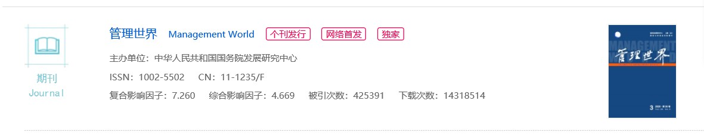

- 管理世界+即时指数

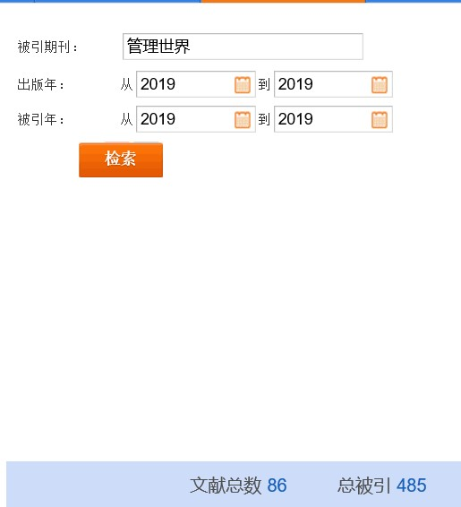

管理世界即时指数：485/86 = 5.64

- 管理世界+被引半衰期

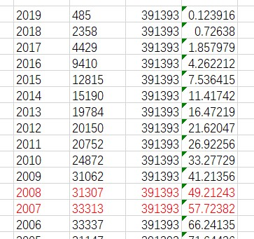

计算得：管理世界的被引半衰期为 10 + (50 - 49.21)/(57.72 - 49.21) = 10.09 年

- 中国工业经济+复合影响因子

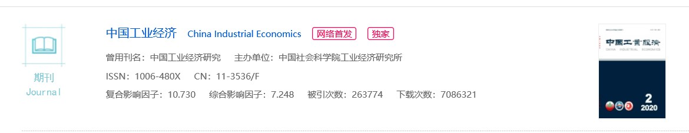

- 中国工业经济+即时指数

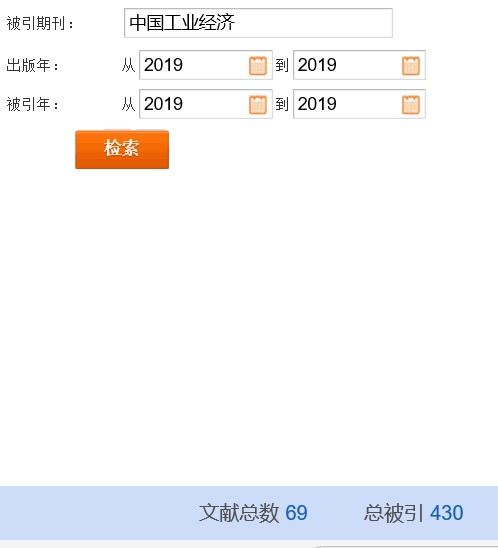

中国工业经济即时指数：430/69 = 6.23

- 中国工业经济+被引半衰期

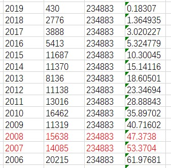

计算得：中国工业经济的被引半衰期为 12 + (50 - 47.37)/(53.37 - 47.37) = 12.44 年
