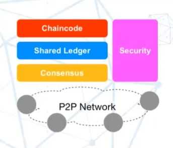

# 区块链概述

## 区块链是什么？

- 分布式数据库
- 分布式数据采集、传输、分析处理

### 演化

1. 数字货币：货币数字化
2. 智能合约：资产数字化
    ——基于区块链的图灵完备的编程脚本语言，适合各种区块链数据结构和共识协议；
3. 衍生应用：广义资产数字化

## 有什么特点？

- 去中心化
- 去信任化
- 不可篡改

## 如何实现？

### 要素

- 智能合约
    类似于业务规则，嵌入在blockchain里面，在交易时执行的脚本；
- 商业网络
    包括市场参与者的对等架构、伙伴间的共识等
- 隐私加密技术
    - 记录通过哈希、加密和个人签名得到保护，
    - 客户收据和参考号都有唯一的ID，
    - 交易隐私化，
    - ID和交易不直接联系，
    - 交易认证
- 共享账簿
    - 记录网络上的所有交易，在参与者间共享且每个人都有自己的副本
    - 许可制
    - 存储
- 共识
    - 共识算法确保每个副本的一致性，降低伪冒交易的风险
    - 所有成员都同意且要验证过
    - 可以建立交易验证的规则

## 区块链+溯源？

将业务链中的每一个点都划分为一个区块，保证每个区块的信息不可篡改，完成了区块链溯源——“善粮味道”

## 区块链+航运

## 区块链+跨境支付结算

## 等等等等。。。

产业数字化升级战略:
1. 传统的产业
2. 数字化升级，科技赋能
3. 依托产业本身的优势，结合科技的赋能，形成平台

“产业互联网”发展模式：
1. 业务优化和**数字化**
2. 产业数据**智能化**
3. 数据资产**金融化**

面临的问题：
1. 区块链平台很多，用户难以认识和评估企业合适那种服务；
2. 很多项目停留在Poc阶段，没有进入生产系统和大规模应用，未形成真正的行业/场景解决方案；
3. 缺乏产品化和评测标准，缺少“开箱即用”的区块链产业化平台；

## Hyperledger Fabric 1.4 LTS

## 项目概览

- Hyperledger 是什么？
一套**开源软件**，分布式账本（数据库）
- 遵守什么开源协议？
Apache v2 License 适合商业软件的开源协议
- 属于什么组织？
Linux Foundation Linux基金会
- 作用？
    实现区块链的理论
    - 身份
    - 智能合约

- Fabric 是什么？
Hyperledger 软件套中的一个顶级软件，其他还有11个
- 什么语言实现？
GO
- 定位？
建立分布式账本的框架，身份识别主要靠链码，隐私性保证有加密包
- 框架？

- SDK语言支持？
Node.js
!['https://github.com/hyperledger/fabric/fabric-sdk-node']
Python
!['https://github.com/hyperledger/fabric/fabric-sdk-py']
Java
!['https://github.com/hyperledger/fabric/fabric-sdk-java']
Golang
!['https://github.com/hyperledger/fabric/fabric-sdk-go']

- 什么是 Sawtooth？
Hyperledger 软件套中的一个顶级软件，Python实现
- 有什么特性？（解决了什么问题？）
    - PoET consensus（PoET 共识机制，性能和可拓展性有一定优势）
    - 交易族（使用交易族，开发链码的时候可以更方便）
    - 可拓展性

- 什么是 Iroha?
Hyperledger 软件套中的一个顶级软件，C++实现
- 有什么特性？
    - C++ 环境支持
    - 移动和Web应用的支持
    - Sumeragi consensus（又一个共识机制）

- 什么是 Explorer？
Hyperledger 软件套中的一个顶级软件，Node.js实现，Intel，DTCC，IBM共同提出
- 什么特性？
    - 区块链的Web UI
    - 单页应用

- 什么是 Cello？
Hyperledger 软件套中的一个顶级软件，Python和JavaScript实现，由IBM提出
- 什么特性？
    - 区块链的操作系统
    - 高性能
    - 可拓展
    - 可插拔

- 什么是 Indy？
Hyperledger 软件套中的一个顶级软件，Python实现，Sovrin 基金会
- 什么特性？
    - 分布式数字身份管理机制
    - 跨链，跨应用

- 什么是 Composer？
Hyperledger 软件套中的一个顶级软件，JavaScript实现，IBM
- 什么特性？
    - 配合 fabric 更快速地开发智能合约
    - 资产管理模型

- 什么是 Burrow？
Hyperledger 软件套中的一个顶级软件，GOlang实现，Monax，Intel
- 什么特性？
    - 以太坊 VM 支持（由于Ethereum VM 不是Golang开发的，所以在hyperledger 环境中使用以太坊虚机有困难）
    - Proof-of-Stake 共识机制

- 什么是 Quilt？
Hyperledger 软件套中的一个顶级软件，Java实现，Everis，Rippole，Applied Payments
- 什么特性？
    - W3C 互联账本协议
    - 跨链交易信息传输

- 什么是 Caliper？
Hyperledger 软件套中的一个顶级软件，Node.js实现，Huawei
- 什么特性？
    - fabric，sawtooth 性能评估

- 什么是 Usra？
Hyperledger 软件套中的一个顶级软件，Rust实现，Fujitsu，Sovrin，Intel
- 什么特性？
    - 现代密码学工具库
    - 各国密码学标准支持
    - 零知识证明工具库

- 什么是 Grid？
Hyperledger 软件套中的一个顶级软件，Python实现
- 什么特性？
    - 基于区块链的供应链模型
    - 智能合约，领域模型，应用样板
