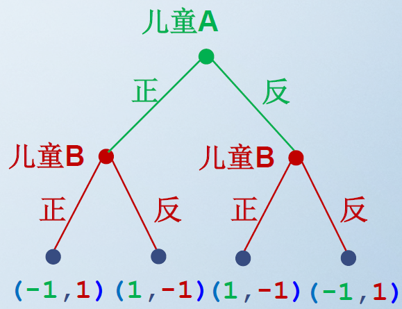

# 第三讲 完全信息动态博弈

## 3.1 扩展式博弈

扩展式博弈(extensive form)的要素：

* 博弈的参与人 $N$
* 参与人的决策顺序 $M$
* 参与人的行动空间 $A$：每次决策参与人有什么选择
* 参与人的信息集 $H$：每次行动参与人知道什么
* 参与人的支付函数 $u(.)$；是所有参与人策略的函数

为了描述扩展式博弈的五要素，我们可以用博弈树(game tree)来表述。

``` mermaid
graph TB
    1((X_0 <br /> 初始节))
    2((X_1 <br /> 决策节))  
    3((X_2 <br /> 决策节))
    4((X_3 <br /> 终点节))
    5((X_4 <br /> 终点节))
    6((X_5 <br /> 决策节))
    7((X_6 <br /> 终点节))
    8((X_7 <br /> 终点节))
    9((X_8 <br /> 终点节))

    1 --> 2
    1 --> 3
    2 --> 4
    2 --> 5
    3 --> 6
    3 --> 7
    6 --> 8
    6 --> 9
```

完全(complete)且完美(perfect)信息：在博弈进行的每一步当中，要选择行动的参与人知道这一步之前的整个过程；

每一条棱都表示参与人的一个行动；
每个节点最多只能有一个父节点；
并不要求每个链条都要有所有的参与人；

* 完美(perfect)信息：处于完美信息环境的参与人，都知道决策链条的历史信息。**如果一个链条（贯序博弈）的每个决策节都是单节信息集，那么这个博弈就是完美信息博弈**；

## 3.2 信息集

信息集(information set)：满足以下三个条件的决策节的集合，

* 信息集中每个决策节都属于同一个参与人；
* 参与人无法区分同一个信息集的决策节；
* 参与人在每个信息集中都有相同的行动空间；

## 3.3 策略与行动

* **行动(Action)**：每一个决策节参与人决策的具体选择；
* **策略(Strategy)**：一个完整的计划，它明确了参与人所有可能遇到的情况的行动选择（每个信息集的决策节中选择的行动），例如性别战中，女生后手的策略是{足球芭蕾，...}，这里的足球芭蕾的意思是女生面对男生的不同选择，分别采取足球和芭蕾两个选择；

再同时的静态博弈决策中，行动即策略；但在动态博弈中，策略与行动不等价，不同信息集下所能采取的行动是不同的，而所有的信息集下所能采取的所有行动的加总，则是策略；

* 纯策略：动态博弈的纯策略描述的是博弈中的一个完备的计划，它描述了参与人 $i$ 在他的每一个信息集中将会选择的纯行动；
* 混合策略：在纯策略的基础上进行概率化、随机化；
* 行为策略(behavioral strategy)：对纯策略的每一个信息集进行独立的概率化、随机化；

对于完美信息博弈，混合策略和行为策略是等价的；

## 3.4 扩展式的标准式表达

* 通过将扩展式的纯策略集当作标准式的纯策略集来使用，从而将扩展式博弈转化为标准式博弈；
* 每一个扩展式对应唯一一个标准式，反过来不成立；
* 通过转化可以帮助我们找到纳什均衡；

### 例子1：动态猜字游戏的标准式

* 儿童A的策略集：(正， 反)
* 儿童B的策略集：(正正，正反，反正，反反)

### 例子2：动态性别战的标准式

* 男生的策略集：{足球，芭蕾}
* 女生的策略集：{足球足球，足球芭蕾，芭蕾芭蕾，芭蕾足球}

## 3.5 子博弈

在动态性别战中，Nash均衡有(足球，足球足球)、(足球，足球芭蕾)、(芭蕾，芭蕾芭蕾)，但是男生是先手，他没有理由选择主动选择芭蕾，所以均衡(芭蕾，芭蕾芭蕾)看起来并不合理；

我们将引入更严格的均衡概念以移除不合理的Nash均衡；

* 子博弈：当博弈进行到某点时，前面整个博弈的进行过程对所有的参与人而言都是共同知识，从该点开始的部分博弈称之为原博弈的**子博弈**；

扩展式博弈的子博弈需要满足一下三个条件：

* 始于博弈树中的**单节信息集**的决策节（不包括初始节）；
* 包括博弈树中从该决策节开始的**所有后续节**（决策节和终点节）；
* 没有对任何信息集形成分割。（如果信息集的一个决策节包含在子博弈中，则这个信息集中的其他决策节也必须在这个子博弈中）；

### 子博弈精炼Nash博弈

* 如果博弈参与人的策略组合在每一个子博弈中都构成Nash均衡，则称**子博弈精炼**(subgame perfect)Nash均衡

* 子博弈精炼Nash均衡存在性：在任何有限参与人、每个参与人的可行策略集有限的博弈中，都存在子博弈精炼Nash均衡，包括混合策略。

ps. 子博弈精炼Nash均衡是更强的Nash均衡，所以当某（对整体而言）Nash均衡在子博弈中不是Nash均衡那该均衡就不是子博弈精炼均衡；

## 3.6 逆向归纳法

* 对于有限的完全且完美信息动态博弈，我们可以使用 **逆向归纳法(backward induction)** 求解子博弈精炼Nash均衡。
* 逆向归纳法：从那些直接与博弈终点相连接的决策节开始，寻找该决策节上参与人的最优选择；然后，退到上一层的决策节，寻找其参与者的最优选择；如此类推，直到初始节，即最高层次的子博弈。

### 例子1：动态性别战的逆向归纳

* 在第二阶段，如果女生观察到男生在第一阶段选择足球，则其应该选择足球。反之，如果男生在第一阶段选择芭蕾，则女生会选择芭蕾。
* 回到第一阶段，根据女生第二阶段的选择，男生的最优选择是足球。
* 子博弈完美Nash均衡：(足球，足球芭蕾)

### 例子2：Stackelberg 垄断模型

* 参与人：企业1、2
* 行动顺序：企业1先选择，企业2后选择
* 行动空间：产量，$q_1 \ge 0, q_2 \ge 0$
* 信息集：完全完美信息，企业2可以观察企业1的选择
* 支付函数：市场价格$P(Q) = a - Q, Q = q_1 + q_2$

解法：
从企业2的子博弈出发，求出企业2对于企业1的最优反应：
$$
\max \limits_{0 \le q_2 \le \infin} u_2 (q_1, q_2) = q_2 [a - (q_1 + q_2) - c]
$$
最优反应函数：$R_2(q_1) = \dfrac{a - q_1 - c}{2}$

企业1在知道企业2会选择最优反应的基础上选择产量：
$$
\max \limits_{0 \le q_1 \le \infin} u_1 (q_1, R_2(q_1)) = q_1 [a - (q_1 + q_2) - c]
$$

得到逆向归纳解：$q_1 = \dfrac{a - c}{2}, R_2(q_1) = \dfrac{a - c}{4}$

## 3.7 逆向归纳法的适用范围

* **不完美信息博弈不适用**：逆向归纳法需要分辨终点节前面的最后参与人集合，然后最大化这个阶段的支付函数，不完美信息集无法确定上家选了什么，所以无法写出最大化的式子；

* **无限次重复博弈不适用**。

## 3.8 不完美信息博弈的逆向归纳

1. 如果遇到非单节信息集就跳过先，继续向上直到遇到一个单节信息集；
2. 然后同时考虑单节信息集行动的参与人的选择，以及被忽略的非单节信息集的参与人的选择；(相当于假定他们同时行动)
3. 此外，还能将非单节信息集当作完全信息博弈来处理；

### 例子：不完美信息进入障碍博弈

该博弈存在一个子博弈，该子博弈由于不完美信息集的存在，我们可以将其看作完全信息静态博弈来求解Nash均衡，解得Nash纯策略均衡为：（低价，容忍）；

回到上一层博弈，初始节挑战者将选择进入市场（进入市场的均衡比不进入市场的支付要高），所以子博弈完美Nash均衡为（低价，容忍）；

## 3.9 重复博弈

* **重复博弈**(repeated game)：是一个特殊的多阶段博弈，在这个博弈中的每一个阶段都重复着同一个阶段博弈。分为重复有限和重复无限博弈；

    - **有限重复博弈**指同一个阶段博弈重复有限次。给定阶段博弈 $G$，令 $G(T, \delta)$ 表示 $G$ 重复 $T$ 次的有限重复博弈，其中 $\delta$ 是参与人的**贴现因子**。在下一阶段博弈开始前，所以之前的博弈可被观察，$G(T, \delta)$ 的收益为T次阶段博弈收益的现值相加。

    - **无限重复博弈** $G(\infin, \delta)$，指阶段博弈G将无限次重复进行，并且每一阶段都是可观测的。

### 有限重复博弈

* 若阶段博弈 $G$ 具有唯一的子博弈精炼Nash均衡：则该有限重复博弈拥有唯一的Nash均衡（同一阶段重复这个唯一的子博弈精炼均衡）；
* 若阶段博弈 $G$ 存在多个Nash均衡时：有限重复博弈有可能存在均衡，但不是各阶段Nash均衡的叠加；

* 折现因子的概念：子博弈的支付和父博弈的支付的加权和的权数；

#### 例子：阶段博弈出现多个均衡的情况

折现因子 $\delta = 1$；
考虑以下博弈重复两阶段的的情况：

考虑一个策略组合：
$(M_1L_1L_1L_1L_1R_1L_1L_1L_1L_1, M_2L_2L_2L_2L_2R_2L_2L_2L_2L_2)$
不是说这个博弈就是均衡博弈；
可以看到这个策略组合在第二阶段构成一个Nash均衡；
现在考察是否构成整个博弈的Nash均衡；
根据这个策略组合，通过加权和的计算得到下表；

可以看到该策略组合的确是整个博弈的Nash均衡；

注：这里并不是在解一个Nash均衡，而是在验证一个策略集是否是整体博弈的Nash均衡解；

### 无限重复博弈

* 对于无限重复博弈，即使阶段博弈有唯一的Nash均衡，也可能存在子博弈精炼均衡，其中没有一个阶段的结果是 $G$ 的Nash均衡；

* 令 $G$ 为一个有限的完全信息静态博弈，令 $(u_1^*, \dots , u_n^*)$ 表示 $G$ 的一个Nash均衡支付，$(u_1 , \dots , u_n)$ 表示其他可行支付，如果对于每一个参与人 $i$ 有$u_i>u_i^*$，且 $\delta$ 足够接近于1，则无限重复博弈 $G(\infin, \delta)$ 存在一个子博弈精炼Nash均衡，其每阶段的平均支付达到 $(u_1 , \dots, u_n)$；

* 在无限重复博弈中，只有参与人有足够的耐心(δ足够接近于1)，就总存在策略使得合作称为可能。

* 一个常用的策略是触发策略(trigger strategy)：如果没有人选择不合作，合作将一直进行下去；一旦有人选择不合作，就会触发其后所有阶段都不再合作。(触发条件是需要计算的，结合触发前后支付函数的变化，通过控制参数，保证触发策略不会被打破)
