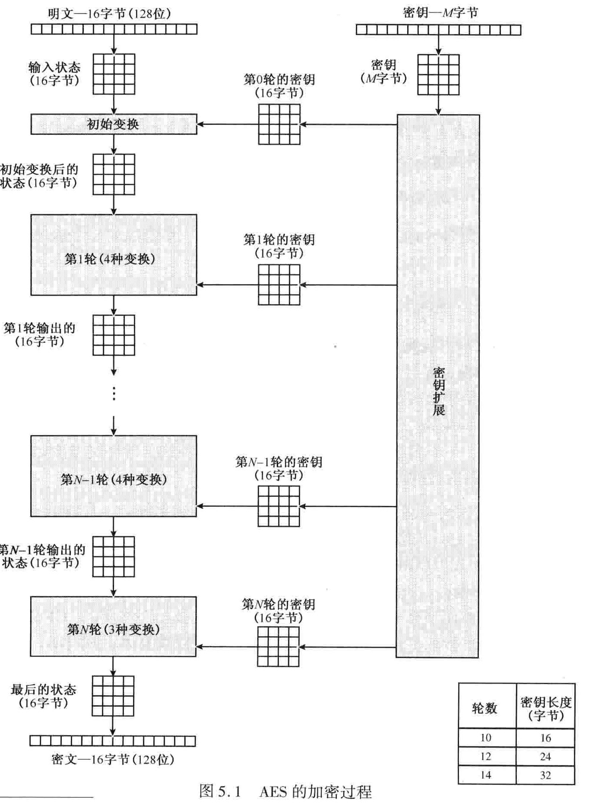
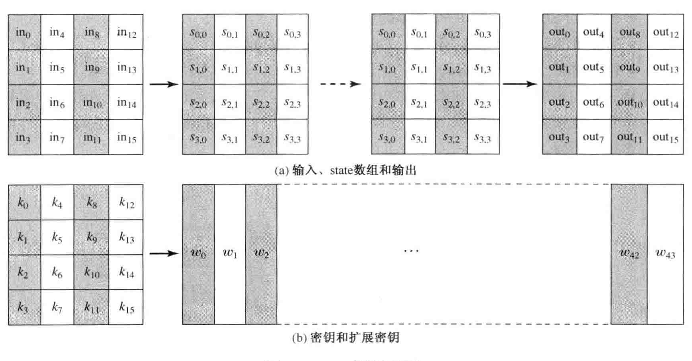
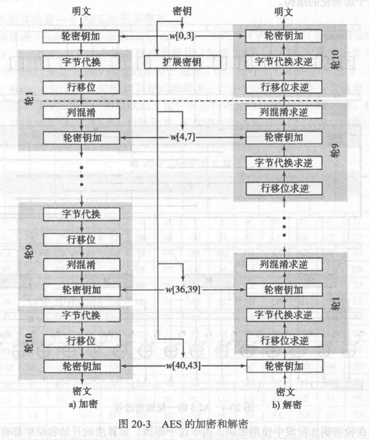

## AES

### AES 总体结构

* 明文分组长度：16字节（128位）
* 密钥长度：16字节，24字节或32字节（128位，192位，256位）
* 迭代轮数：10轮，12轮，14轮（不同轮数对应不同的密钥长度）

### AES 的数据结构

明文和密钥排列：按照字节组成字节矩阵，每个字节块按列排序。

图中展示了128位的密钥矩阵和扩展密钥，**128位**（16字节）的密钥被扩展成**44字**长的密钥序列。一个字等于四个字节。

### 以 AES-128 为例

步骤描述：

1. 该结构显然不是Feistel结构；
2. **密钥扩展**：输入的密钥被扩展成44个32位的字组成的数组 $w[i]$ 。有4个不同的字（128位）作为该轮的轮密钥；
3. **初始变换**：开始第一轮之前先进行一轮轮密相加；
4. **轮函数**：每轮（除了**最后一轮没有列混淆**）都由四个阶段组成：

   * 字节代换（代替）：使用S盒完成分组中的按字节代替。
   * 行移位（置换）：简单的一行代替另一方。
   * 列混淆（代替）：对列的每个字节做替换，是一个与本列全部字节相关的函数。
   * 轮密钥加（代替）：利用当前分组和扩展密钥的一部分进行按位XOR（异或）

5. 加/解密**流程一样**（实质使用的函数不同），都是经过9轮四阶段迭代运算，然后经过一个三阶段第10轮的运算。

下面是完整的**轮函数**的结构：

1. 算法的两端必须由轮密钥加担当，否则就有可能在不知道密钥的情况下就能够执行逆操作，故不能增加算法的安全性。
2. 就轮密钥加本身来说是容易破译的，但是其他三个阶段提供位混乱的功能，经过多轮迭代，就显得很安全。
3. 每个阶段均可逆。三个位混乱阶段都是可逆的。而轮密钥加操作的可逆性原理在于：$A \oplus A \oplus B = B$
4. 解密算法并非完全和加密算法对称，密钥的使用顺序也是逆序的，这是由于加密算法的结构决定的。
5. 加/解密第10轮只有三阶段（字节代换、行移位、轮密钥加）。

#### AES 的变换函数

下面开始讨论 AES 单轮加密/解密过程中使用的函数基本原理。

##### 字节代换

##### 行移位

##### 列混淆

##### 轮密钥加

#### 密钥扩展
