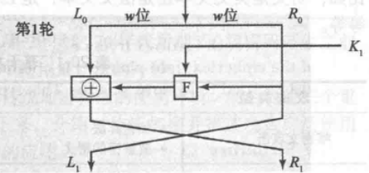
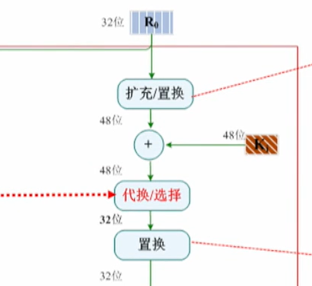
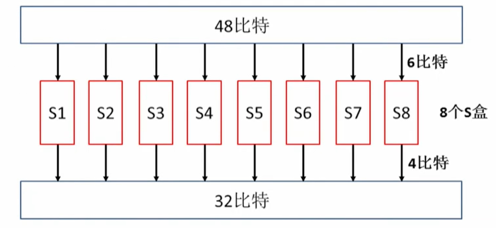
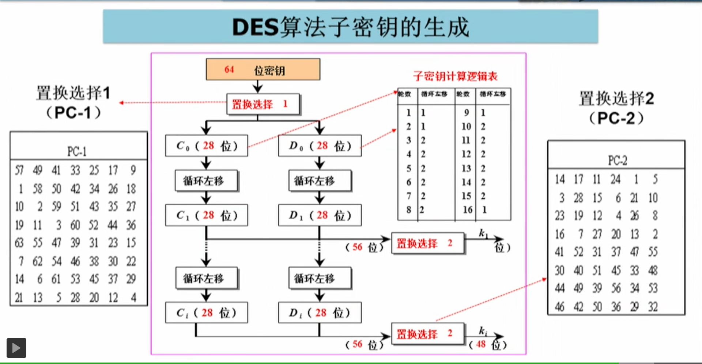

## DES 算法

数据加密标准（Data Encryption Standard）

* 对称分组加密算法
* 1998年12月后，不再作为联邦加密标准（安全性不再有保障）；

我们先看一个与 DES 相关的加密算法结构：Feistel网络，他是第一个描述 DES 加密算法的一个结构；

### Feistel 密码结构

* 分组长度：（性能or安全性）推荐值：128位
* 密钥长度：（性能or安全性）推荐值：128位
* 迭代轮数：（性能or安全性）推荐值：16轮
* 子密钥产生算法：越复杂越安全
* 轮函数：越复杂越安全
* 快速软件加/解密：速度很重要
* 简化分析难度：这里指的是简化算法描述的难度，易于分析才能分析其脆弱性，便于改良；

Feistel 网络是加密算法的一个框架，而 DES 是该框架的一个实现。

### 加密过程

DES 属于分组加密算法，处理的分组长度为64位，密钥长度为56位为了便于运算扩充为64为，扩充的8位可以用于校验或者随意设置。加密分为以下步骤：

1. 输入64位明文
2. 初始置换
3. 16轮迭代
4. 交换左右32位
5. 初始逆置换
6. 输出64位密文

#### 初始置换

给定一个 $8 \times 8$ 置换矩阵 $IP$ ，根据该矩阵置换64位的输入数据，这里只发生了数据位置的变化，数据未改变；

#### 16轮迭代

我们看单轮迭代如何运算。

图中的 $w$ 为32。

单轮迭代算法细节：

1. 右32位与**子密钥**1输入**轮函数** $F$ 中；
2. 输出的结果与左32位进行**异或**运算；
3. 输出的结果作为下一轮的右32位输入；
4. 原右32位作为下一轮的左32位输入；

##### 轮函数 $F$

32位输入先被扩充为48位（因为子密钥长度为48位），再与子密钥异或，得到的结果再进行代换选择（8个 S 盒），产生的32位结果再通过置换得到输出；

###### S 盒

S 盒是一个从6位选出4位的一个算法，单个 S 盒如下：

6位输入的第一位和第六位决定选择的行，中间四位决定选择的列，行列决定了一个0~16的数字（4位长），该数字位输出。

DES 算法中的选择代换是由8个不同的 S 盒组成的：

##### 子密钥生成算法

首先通过置换选择表，从64位密码中选择56位密钥并按照表的顺序排好，再分成左右两部分，按照计算逻辑表进行循环左移，再拼接成56位的结果，输入到置换选择表中，选出48位的**子密钥**。

### DES 算法的形式化描述

* 加密：

    $$
    \begin{aligned}
    (<64bit>)IP &\to L_0 R_0 \\
    R_{t-1} &\to L_t \quad t \in [1,16] \\
    f(R_{t-1}, k_{t-1}) \oplus L_{t-1} &\to R_t \quad t \in [1,16] \\
    IP^{-1}(R_{16} L_{16}) &\to (<64bits>)
    \end{aligned}
    $$

* 解密：

    $$
    \begin{aligned}
    (<64bit>)IP &\to R_{16} L_{16} \\
    R_t &\to L_{t-1} \quad t \in [1,16] \\
    f(R_t, k_t) \oplus L_t &\to R_{t-1} \quad t \in [1,16] \\
    IP^{-1}(L_0 R_0) &\to (<64bits>)
    \end{aligned}
    $$
