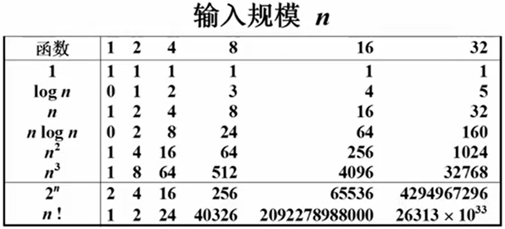
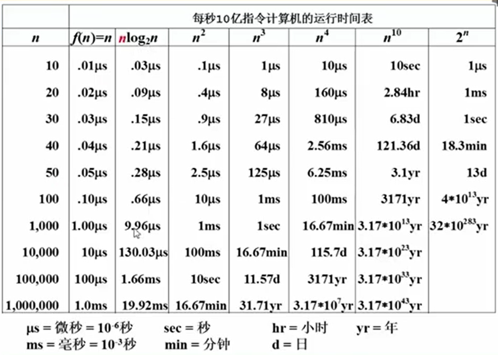

## 数据结构

### 概述

算法+数据结构=程序  
数据结构是现实世界中的**数据**以及其**关系**的一种反映。他可以从**逻辑结构**和**存储结构**两个方面进行刻画。

#### 一些基本概念

##### 数据和数据结构

> **数据(data)**：数据是能够被计算机处理的符号的总称。  
> **数据元素(data element)**：数据中的个体，是数据的基本组织单位。又称结点，顶点和记录。  
> **数据项(data item)**：数据元素的组织单位，数据元素的某一个属性，例如：产品的生产编号、个数、流水线条数等。  
> **数据对象(data object)**：性质相同的数据元素的集合，例如狗的数据对象，包括了许多狗的数据元素，每个数据元素包括品种、年龄、犬型等等数据项。  
> **数据结构(data structure)**：相互之间存在关系的数据元素集合。我们一般从数据的逻辑结构、存储结构和操作三个方面进行考量。  
> **逻辑结构**：面向用户的数据元素的组织形式，包括**集合**结构、**线性**结构、**树形**结构、**图形**结构。  
> **存储结构**：面向计算机的数据元素的组织形式，包括
>
> - **顺序存储方式**：要求逻辑上相邻的元素在对应的物理位置上也相邻。
> - **链式存储方式**：数据元素可以存放在任意物理位置上。每一个数据元素都会包含链接到下一个数据元素的指针。  
> - **索引存储方式**：在存储数据元素的同时，还会创建一个索引表，索引表的每一项包括了关键字和对应的地址。  
> - **散列存储方式**：将数据元素存储在一片连续的区域内，具体的地址是根据元素的关键字用哈希算法计算出来的。顺序存储方式和链式存储方式是常用的两种存储方式，而索引存储方式和散列存储方式是为了提高查找效率而采用的两种存储方式。  
>
> **数据操作**：创建、销毁、插入、删除、查找、修改、遍历。  
>
> **数据抽象(data abstraction)**：分离数据的使用和实现的做法。通常我们不会关心某些方法是如何实现的，往往关心的是我们应该如何做。  
> **抽象数据类型(abstract data type)**：**隐藏**了数据的存储结构并且不涉及实现细节的数据类型，由 **数据对象集** 和 **操作集** 构成。在Java中，提供了两种数据抽象的方式：**抽象类(abstract class)**和**接口(interface)**。抽象类通过继承(extern)来实现数据类型的描述和实现。接口通过实现(implement)该接口的类来实现。

### 算法(Algorithm)

- 有限指令集合
- 接受输入
- 产生输出
- 有限步后终止
- 目标明确没有歧义
- 计算可达
- 抽象，不依赖于具体的计算机或者语言实现

```c
void SelectSort(int List[], int N){
    for(i = 0; i < N; i++) {
        MinPosition = ScanForMin(List, i, N-1);
        Swap( List[i], List[MinPosition]);
    }
}
```

算法评价指标：

- 时间复杂度 $T(N)$
- 空间复杂度 $S(N)$

#### 空间复杂度计算案例

这是一个输出从1到N的整数的递归程序：

```c
void PrintN (int N){
    if(N){
        PrintN(N-1);
        printf("%d\n", N);
    }
}
```

每次运行都会保存上一次函数的执行位置上下文，当到达递归底部的时候，占用了 N 个函数上下文的空间，空间复杂度为：$S(N) = C \cdot N$.

#### 时间复杂度计算实例

下面是一个计算 n 项式的值的程序[^1]：

[^1]: 这个程序其实写得不好，时间复杂度高，利用**秦九韶算法**能有效降低算法时间复杂度。

``` c
double f(int n, double a[], double x) {
    int i;
    double p = a[0];
    for (i = 1; i < n; i++) {
        p += (a[i] * pow(x, i));
    }
    return p;
}
```

每次循环执行了 $i$ 次乘法（$i-1$ 累乘 + 1 次乘法），共 $n$ 次乘法，总计 $\frac{n^2+n}{2}$ 次，时间复杂度为：$T(n) = C_1 n^2 + C_2 n$.

#### 常用指标

- 最好时间复杂度 $T_{best}(n)$
- 最坏时间复杂度 $T_{worst}(n)$
- 平均时间复杂度 $T_{avg}(n)$

$$
T_{worst}(n) \le T_{avg}(n)
$$

#### 复杂度的渐进表示法

我们研究算法复杂度的时候往往只关注最影响算法效率的项，其他的项则只用一个常数倍来表示。

$T(n) = \Omicron(f(n))$ 表示 $\exist n_0, C > 0$ 使得 $T(n) \le C  \cdot f(n),(n > n_0)$
$T(n) = \Omega(f(n))$ 表示 $\exist n_0, C > 0$ 使得 $T(n) \le C  \cdot f(n),(n > n_0)$
$T(n) = \Theta(f(n))$ 表示同时有 $T(n) = \Omicron(f(n))$ 和 $T(n) = \Omega(f(n))$

  

  

#### 复杂度分析技巧

**加法法则**：
$T_1(n) + T_2(n) = \max {\large(} \Omega(f_1(n)), \Omega(f(n) {\large)}$
**乘法法则**：
$T_1(n) \times T_2(n) = \Omega(f_1(n) \times f_2(n))$

若 $T(n)$ 是 $n$ 的 $k$ 阶多项式，那么 $T(n) = \Theta(n^k)$
`for` 循环中，时间复杂度为 循环次数 $n$ 乘以 循环体代码复杂度
`if-else` 中，时间复杂度取决于，条件判断和两个分支中最大的复杂度

常用的时间复杂度大小顺序：
$$
O(1) \lt O(\log_2n) \lt O(n) \lt O(n\log_2n) \lt O(n^2) \lt O(n^3) \lt O(2^n) \lt O(n!) \lt O(n^n)
$$
