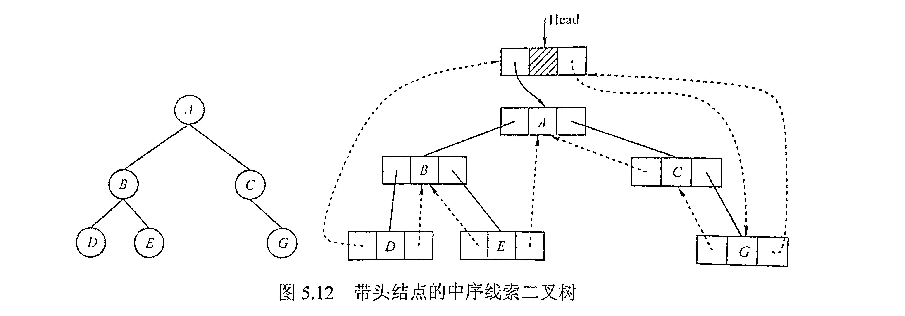
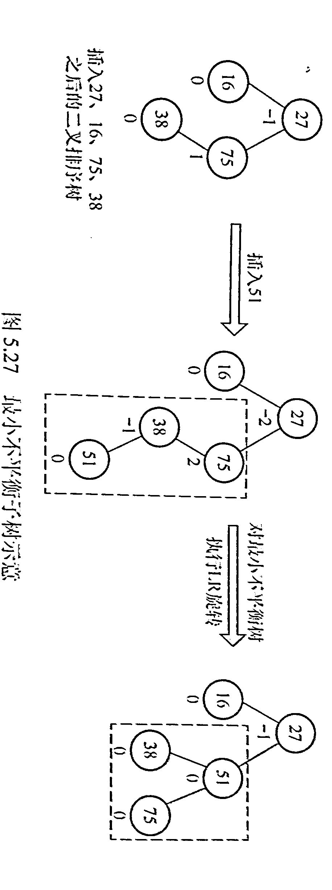
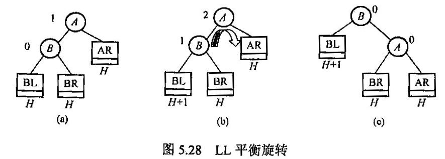
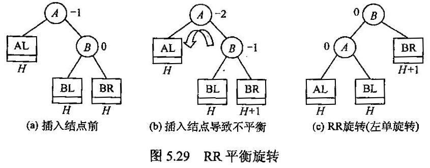
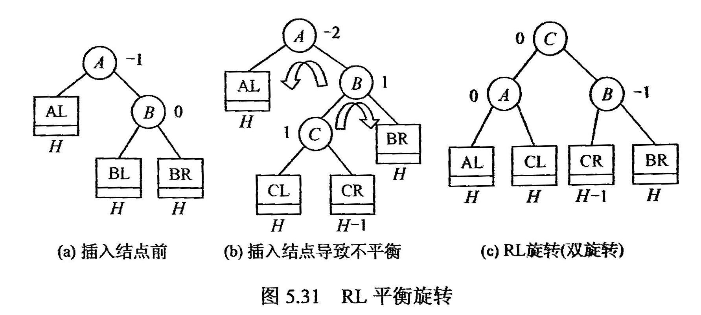
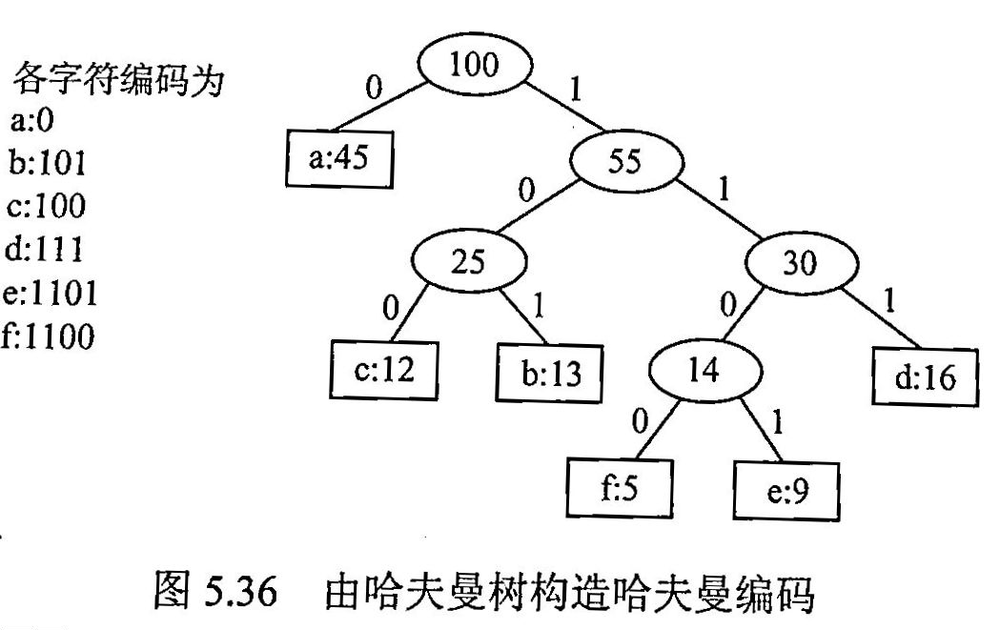
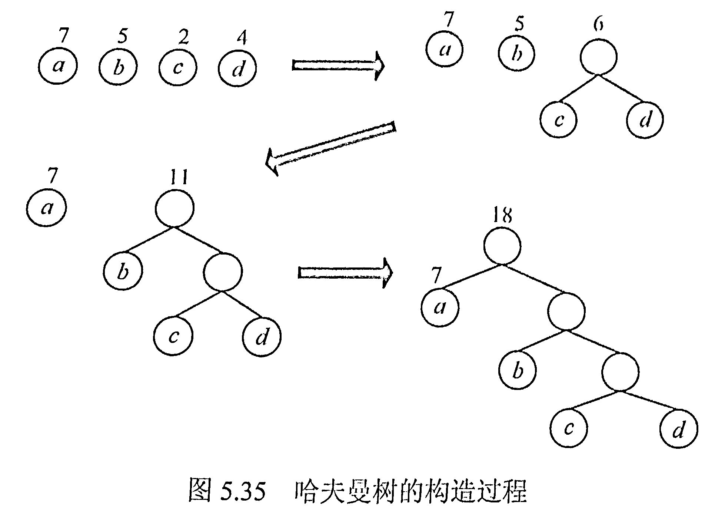

## 树

是一种包含层次结构的数据结构；
是由 $n$ 个结点构成的有限集合，每个结点至多只有一个双亲结点，可以有零个或多个子节点。

### 树的一些概念

**结点度**：一个节点的子节点个数；
**树的度**：一棵树中最大的结点度；
**路径**：连接两个结点之间所经过的结点序列是路径，树中的路径是从上到下的；
**路径长度**：路径所经过的边数；

### 树的性质

1. 树的结点数等于所有的结点度数加 1；
2. 度为 $m$ 的树中第 $i$ 层上至多由 $m^{i-1}$ 个结点 $i \le 1$；
3. 高度为 $h$ 的 $m$ 叉树至多有 $(m^h - 1)/(m-1)$ 个结点（满 $m$ 叉树的情形，是一个公比为 $m$ 的等比数列和）；
4. 具有 $n$ 个结点的 $m$ 叉树的最小高度为 $\lceil \log_m(n(m-1) + 1) \rceil$（结合上一条，注意向上取整的操作）；

### 查找

- 静态查找：查找的集合不变
- 动态查找：查找的集合会改变

1. 顺序查找
2. 二分查找（要求有序）

### 二叉树

二叉树是有序树，每个结点至多只有两棵子树。
二叉树与度为 2 的树的区别：

1. 度为 2 的有序树至少有 3 个结点，而二叉树可以为空（换言之二叉树是一个树的概念，而不是说他是具体的某一种度为 2 的树，可以为 1 也可以为 0）；
2. 度为 2 的有序树的孩子的左右次序是相对于另一个孩子而言的，若某个结点只有一个孩子，则这个孩子无需区分其左右次序；而二叉树无论孩子结点树是否为 2，均需要确定其左右次序，即二叉树结点次序是绝对的，而非相对的；

#### 几个特殊的二叉树

1. *满二叉树*：高度为 $h$ ，结点数为 $2^h - 1$；
2. *完全二叉树*：高度为 $h$ ，每个结点的编号与高度为 $h$ 的满二叉树对应的编号相同；
    - 若 $i < \lfloor n/2 \rfloor$ ，则结点为分支结点，否则为叶子结点；
    - 叶子结点只可能在层次最大的两层上出现，对于最大层次中的叶子结点，都依次排列在最左边的-位置；
    - 若有度为 1 的结点，则只可能有一个，并且是左孩子结点；
    - 按层序编号后，一旦出现某结点（编号为 $i$ ）为叶子结点或只有左孩子，则编号大于 $i$ 的结点均为叶子结点；
    - 若 $n$ 为奇数，则每个分支结点都有左孩子和右孩子；若 $n$ 为偶数，则编号最大的分支结点（编号为 $n/2$ ）只有左孩子，没有右孩子，其余分支结点左、右孩子都有；
3. *二叉排序树*：左子树上的所有结点的关键字均小于根结点的关键字；右子树上的所有结点的关键字均大于根结点的关键字；左子树和右子树又各是一棵二叉排序树；
4. *平衡二叉树*：树上的任一结点的左子树和右子树的深度之差不超过 1；

#### 二叉树的性质

1. 非空二叉树上的叶子结点数等于度为 2 的结点数加 1，即 $n_0 = n_2 + 1$；
2. 非空二叉树上的第 $k$ 层上至多有 $2^{k-1}$ 个结点；
3. 高度为 $h$ 的二叉树最多有 $2^{h-1}$ 个结点；
4. 对完全二叉树按从上到下、从左到右的顺序依次编号为 $1, 2, 3, \cdots, n$：
   1. 当 $i > 1$ 时，结点 $i$ 的双亲编号为 $\lceil i/2 \rceil$ ，即当 $i$ 为偶数时，其双亲的编号为 $i/2$ ，它是双亲的左孩子；当 $i$ 为奇数时，其双亲的编号为 $(i-1)/2$，它是双亲的右孩子。
   2. 当 $2i \le n$ 时，结点 $i$ 的左孩子编号为 $2i$ ，否则无左孩子；
   3. 当 $2i + 1 \le n$ 时，结点 $i$ 的右孩子编号为 $2i$ ，否则无右孩子；
   4. 结点 $i$ 所在层次（深度）为 $\lfloor \log_2 i \rfloor + 1$ ；
5. 具有 $n$ 个结点的完全二叉树的高度为 $\lceil \log_2(n+1) \rceil$ 或 $\lfloor \log_2(n) \rfloor + 1$；

#### 二叉树的顺序存储

由于树是非线性结果，若想用线性的顺序存储结构来存储，必须找到非线性的结点与顺序存储单元下标之间的对应关系；
对于完全二叉树，我们可以按照从上到下、从左到右逐层编号的方式给每个结点编号，这个编号对应顺序存储结构的下标；
对于非完全二叉树，我们则引入虚拟结点将其填充为完全二叉树，而虚拟结点中不包含数据，但这样就造成了空间的浪费；最坏的情况是，对于深度为 $h$ 的右支树，他有 $h$ 个结点，占用了 $2^h - 1$ 的内存空间；

#### 二叉树的链式存储

二叉树的链式存储有两种形式：二叉链表、三叉链表

1. 使用一个数据域，两个指针域（左孩子、右孩子）表示一个结点；
2. 使用一个数据域，三个指针域（父结点、左孩子、右孩子）表示一个结点；

通常使用二叉链表实现，以节省空间；

二叉链表的实现分为带头结点和不带头结点的两种情况。

#### 二叉树的遍历

- 层次遍历
- 先根遍历
- 中根遍历
- 后根遍历

##### 层次遍历

```shell
      a
   /     \
  b       c
 / \     / \
d   e   f   g
 \     /
  h   i
```

就是前面完全二叉树的遍历方法；
得到的结果是：abcdefghi

##### 先根遍历

递归执行如下操作直至遍历完成：

1. 访问根结点
2. 先根遍历左子树
3. 先根遍历右子树

按照上图的树的结果得到的是：abdhecfig

##### 中根遍历

递归执行如下操作直至遍历完成：

1. 中根遍历左子树
2. 访问根结点
3. 中根遍历右子树

上图的树中根遍历的结果为：dhbeaifcg

##### 后根遍历

递归执行如下操作直至遍历完成：

1. 后根遍历左子树
2. 后根遍历右子树
3. 访问根结点

上图中的树后根遍历的结果为：hdebifgca

### 树、森林、并查集

### 二叉树的应用

#### 线索二叉树

由于传统的二叉树链表中包含大量的空指针（有 $n + 1$ 个）为了不浪费这些空间，我们将这些空指针指向他们的前驱或者后继，这样可以加快查找二叉树前驱和后继的速度，这就是**线索二叉树**；

线索二叉树的节点构成：
| `lchild` | `ltag` | `data` | `rtag` | `rchild` |
| -------- | ------ | ------ | ------ | -------- |

`ltag`：指示 `lchild` 的指向， 0 指向左孩子， 1 指向结点前驱；
`rtag`：指示 `rchild` 的指向， 0 指向右孩子， 1 指向结点后继；

##### 构造线索二叉树

线索二叉树相比一般二叉树就是多了前驱和后继的结点信息，要获得前驱后继的信息就需要遍历一遍二叉树；

中序遍历构造线索二叉树：

``` C
typedef struct ThreadNode {
    ElemType data;
    struct ThreadNode *lchild, *rchild;
    int ltag, rtag;
}ThreadNode, *ThreadTree;
```

``` C
//中序构造递归方法
void InThread(ThreadTree &p, ThreadTree &pre){
    if(p!=NULL){
        InThread(p->lchild, pre);
        if(p->lchild==NULL){
            p->lchild=pre;
            p->ltag=1;
        }
        if(pre!=NULL&&pre->rchild==NULL){
            pre->rchild=p;
            pre->rtag=1;
        }
        pre=p;
        InThread(p->rchild, pre);
    }
}
//主过程算法
void CreateThread(ThreadTree T){
    ThreadTree pre=NULL;
    if(T!=NULL){
        InThread(T, pre);
        pre->rchild=NULL;
        pre->rtag=1;
    }
}
```

为了遍历方便，一般还会设置一个头结点，头结点的 `lchild` 指向线索二叉树的根 `rchild` 指向中序遍历的最后一个结点；然后将中序遍历的第一个节点 `lchild` 和 和最后一个结点的 `rchild` 指向头结点；这样就构成了一个双向的线索二叉树；
  

利用中序线索二叉树可以很方便地写出中序遍历算法：

``` C
//寻找中序线索二叉树的第一个访问结点
ThreadNode FirstNode(ThreadNode *p){
    while(p->ltag==0) p=p->lchild;//找到最左下角的结点
    return p;
}
//寻找该节点的后继
ThreadNode NextNode(ThreadNode *p){
    //如果有右子树，那么后继就是右子树的第一个结点
    //如果没有右子树，那么本身就是最右下的结点了，无后继了
    if(p->rtag==0) return FirstNode(p->rchild);
    else return p->lchild;
}
//利用上面的两个函数实现中序线索二叉树的中序遍历
void InOrder(ThreadTree *T){
    //从第一个结点起不断访问后继节点
    //由于是通过中序遍历建立起来的，所以按照线索走得到的也是中序遍历的序列
    for(ThreadNode p=FirstNode(T); p!=NULL; p=NextNode(p))
        visit(p);
}
```

类似的，先序遍历和后序遍历构建线索二叉树，只需要改变递归顺序即可完成；

而寻找这两种线索二叉树的第一个结点以及后继则稍稍有些不同，但总体上都是通过对该结点 `p` 的位置（是否有左右孩子？是否是根节点？双亲是否有左右孩子？）判断遍历顺序，从而推出后继。
比如先序：

1. 若 `p` 有左孩子，左孩子就是后继；
2. 若 `p` 无左孩子，有右子树，后继为右子树中的 `FirstNode(p)` ；
3. 若 `p` 为叶结点，则后继为 `p->rchild` ；

后续遍历会遇到需要寻找双亲结点的情况，所以需要采用带标志域的三叉链表作为存储结构；

#### 二叉搜索树（Binary Search Tree, BST)

根据二分查找的方法构建起来的二叉树，满足：

1. 左孩子比根结点小，右孩子比根结点大；
2. 左右子树都是二叉搜索树；

##### 二叉搜索树：插入

使用递归：
若根结点为空，则根据插入值 `X` 创建根结点；
若不为空，则比较插入值和根结点的大小，如果大则调用 `Insert(X, bintree)` 赋值给 `bintree->right`；
如果小则调用 `Insert(X, bintree)` 赋值给 `bintree->left`；

##### 二叉搜索树：删除

分情况讨论:

1. 要删除的结点无孩子；直接删除
2. 要删除的结点有一个孩子；删除之后用孩子替代
3. 要删除的结点有两个孩子；删除之后用右子树最小值或者左子树最大值替代

#### 平衡二叉树

如果二叉搜索树的左右子树高度差距过大了，将会导致性能降低。为了避免这样的情况发生，规定插入和删除时二叉树的左右子树高度差绝对值小于等于 1 ，这样的二叉树称为**平衡二叉树**。**平衡因子**为该节点的左子树和右子树高度之差。

*最小不平衡子树：*
插入路径上离插入结点最近的，以平衡因子绝对值大于 1 的结点为根的子树。

  

二叉搜索树的插入和删除有可能导致失去平衡，因此每次结点操作都需要判断失衡原因，并根据失衡原因做出相应的调整使得二叉树恢复平衡。调整的方式有四种，分别是：

1. LL 旋转（右单旋转）
2. RR 旋转（左单旋转）
3. LR 旋转（先左后右双旋转）
4. RL 旋转（先右后左双旋转）

上述四种调整方式对应以下四种情况：

1. 在结点 `A` 的左孩子（L）的左子树（L）上插入结点，导致结点 `A` 的平衡因子变成 2 ，二叉树失衡；
  

2. 在结点 `A` 的右孩子（R）的右子树（R）上插入结点，导致结点 `A` 的平衡因子变成 2 ，二叉树失衡；
  

3. 在结点 `A` 的左孩子（L）的右子树（R）上插入结点，导致结点 `A` 的平衡因子变成了 2 ，二叉树失衡；
  

4. 在结点 `A` 的右孩子（R）的左子树（L）上插入结点，导致结点 `A` 的平衡因子变成了 -2 ，二叉树失衡；
  

从上图可以看出，所改动的结点的子树都是没有变化的，变化的只有最小不平衡子树的最上面两个到三个的结点，结合二叉搜索树的约束条件来记忆会方便些；

可以证明，平衡二叉树的最大查找深度为 $O(\log_2n)$ ，所以平均查找长度为 $O(\log_2n)$ ，这个结论可以用来求给定节点数的平衡二叉树查找所需的最多比较次数；

#### 哈夫曼树

哈夫曼树的叶节点是某种字符，非叶结点为左右子树叶节点符号的频率或频数之和。
沿着哈夫曼树的根结点到各个叶结点的路径，每经过一个左孩子就增加一个 0 ，每经过右孩子就增加一个 1 （也可以反过来）。最后得到的关于叶结点符号的 *不定长无前缀编码* 称之为 **哈夫曼编码**。
哈夫曼编码可以有效地压缩编码长度。

*带权路径长度WPL* ：$\sum$ (各个字符的编码长度 $\times$  出现频率（频数）)
  

##### 哈夫曼树的构造

1. 将所有叶结点和他们的频数（频率）列出来；
2. 合并两个最小的叶结点得到一棵树，树的根结点写上左右孩子的频数（频率）之和；
3. 将树的根结点和剩余结点放在一起，重复执行 步骤2 直至只剩下一棵树；

  

### 堆

### B 树
