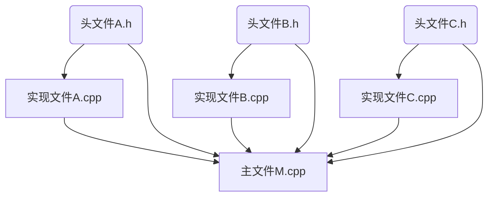

## C++语言程序设计基础（2）

- [C++语言程序设计基础（2）](#c语言程序设计基础2)
  - [概述](#概述)
  - [数据类型](#数据类型)
  - [指针](#指针)
  - [表达式与运算符](#表达式与运算符)
  - [程序控制语句](#程序控制语句)
  - [函数](#函数)
    - [函数的定义](#函数的定义)
    - [函数原型](#函数原型)
    - [函数的参数传递](#函数的参数传递)
      - [值传递](#值传递)
      - [指针传递](#指针传递)
      - [引用传递](#引用传递)
    - [函数返回](#函数返回)
      - [返回基本类型](#返回基本类型)
      - [返回指针类型](#返回指针类型)
      - [返回引用类型](#返回引用类型)
    - [函数调用](#函数调用)
      - [递归调用](#递归调用)
    - [函数地址和函数指针](#函数地址和函数指针)
      - [函数地址](#函数地址)
      - [函数指针](#函数指针)
    - [内联函数和重载函数](#内联函数和重载函数)
    - [变量存储特性与标识符作用域](#变量存储特性与标识符作用域)
    - [多文件程序结构](#多文件程序结构)
    - [预处理指令](#预处理指令)
    - [多文件程序使用全局变量](#多文件程序使用全局变量)
  - [命名空间](#命名空间)
    - [标准命名空间](#标准命名空间)
    - [定义命名空间](#定义命名空间)
    - [使用命名空间](#使用命名空间)
    - [终止程序运行](#终止程序运行)
  - [数组](#数组)
  - [指针数组](#指针数组)
  - [动态存储](#动态存储)
  - [字符串](#字符串)
  - [集合与结构](#集合与结构)
    - [位运算](#位运算)
    - [结构](#结构)
    - [链表](#链表)
    - [插入结点](#插入结点)

### 概述

C++源于 C 语言,有高级语言的数据表示，运算功能，还可以直接对内存进行操作（指针），属于编译型语言，运行效率高，可以面向对象编程，也可以面向过程编程。

> 编译型语言：
> 通过编辑器产生的源代码文件通过预处理、编译、汇编、链接 3 个步骤，编译成二进制的机器语言文件并与库文件进行连接生成.exe 可执行文件，再运行，效率高。
>
> > 编译：将源代码翻译成汇编代码的过程
>
> 解释型语言：
> 通过编辑器产生的源文件通过解释器，逐句将源代码解释为机器代码并运行，效率低。

一个简单的 C++程序例子：

```cpp
#include<iostream> //引入iostream出入输出流库
using namespace std; //使用std标准命名空间

class xxx { //声明类，面向过程可以不需要
 ...
}
int main(){ //声明主函数
  double xxx; //定义变量
  int xxx; //定义变脸
  ...
  cin<<xxx<<endl; //输入参数
  cout<<xxx<<endl; //输出参数
}
```

主函数是程序执行的入口。

### 数据类型

C++的数据类型：

- 基本类型

  - 整型(int,**bool**,**enum**)
  - 浮点型(float,double)
  - 字符型(char)

- 结构类型：

  - 数组([])
  - 结构(stuct)
  - 联合(union）
  - 类(class)

- 指针类型(\*)
- 空类型(void)

根据操作系统和编译系统的不同，每种数据类型的精度和长度都不同，开发时要注意这一点。

枚举类型(enum)的用法：
枚举类型是一种用户自定义的数据类型，用关键字 enum 定义，用标识符表来表示的数据。

```cpp
#include<iostream>
using namespace std;
enum colour{red, yellow, white,black};
int main(){
  colour c;
  c = red;
  cout<<"red:"<<c<<endl;
  c = blue;
  cout<<"blue:"<<c<<endl;
  c = black;
  cout<<"black:"<<c<<endl;
}
```

程序运行结果：

```code
red:0
blue:2
black:4
```

浮点数表示方法：尾数 E（e）指数  
尾数可以为小数或整数，指数必须为整数。

字符型数据支持八进制/十六进制转换成字符类型：\ddd, \xhh  
依据 ASCII 码转换。

### 指针

**指针变量的定义：**  
类型 \* 标识符 //此时\*表示指针变量的声明  
（标识符可以写入地址值）

**注意:** void 类型指针可以存放任意类型对象，但是不可解释所指对象，必须经过强制类型转换才可以解释。

**地址访问：**  
\* 地址值 相当于 访问地址对应的数据对象 //此时\*表示间址访问  
e.t：对 a 的地址访问可以写成\*(&a)，&为取址符

**引用：**  
类型 &引用名 = 对象名  
没有创建新的内存区域，仅仅只是两个变量指向同一个内存区域，且引用必须在定义时初始化。

常量指针（变量）：可以修改指向，不可修改所指向的对象。可用来限制指针对所指对象的修改（可以指向常量）。  
指针常量（常量）：定义时即固定指向（地址值为常量），不可修改指向，可以修改所指变量的值。  
常量指针常量（常量）：指向常量的指针常量，不可修改指向，不可修改所指对象（都是常量）。  
常引用：限制了引用对象对原对象的修改。

### 表达式与运算符

优先级（高到低）：！-> 算数运算符 -> 关系运算符 -> && -> ||

&& || 短路运算符：当判断出根据前一个表达式即可判断结果时，后面的表达式将忽略。

条件表达式：A? B:C  
当 A 为真时则 B，当 A 为假时则 C

### 程序控制语句

选择控制：
if

```cpp
if (){
 ...
}
else{
 ...
}
```

switch

```cpp
switch(){
case 常量1: 语句1; [break;]
case 常量2: 语句2; [break;]
...
[default: 语句n;]
```

循环控制：
while; do while; for

**注意：** for(;;)等价于 while(1)

### 函数

#### 函数的定义

```cpp
类型 函数名([形参表])
{
 语句块;
}
```

#### 函数原型

函数原型是函数的声明，作用是告诉编译器有关函数接口的信息：函数名、返回值的数据类型、参数个数，由于函数原型没有实现代码，所以可以不需要形参表。写法为：  
double max(double,double);

**注意：** 如果函数定义出现在第一次调用之前，可以不需要函数原型。

#### 函数的参数传递

- 值传递
- 指针传递
- 引用传递

##### 值传递

函数中的操作都是对形参的操作，对实参没有影响。

函数调用时，不应该将表达式作为实参进行调用，因为表达式之间可能相互影响，在不同的编译系统中，可能有不同的实参表。

默认参数要放在函数名第一次出现的时候，且其他参数都要在默认参数之前。

默认参数的默认值可以是常量、全局变量或函数调用，但不能是局部变量。

##### 指针传递

形参表中的形参被声明为指针类型，调用时，传递的是实参的地址，因此对形参的操作会影响到实参。
可以用 const 来限制对实参的修改。

##### 引用传递

相当于形参和实参形成绑定关系，对形参的操作就是对实参的操作。引用参数传递不会产生形参副本，面对大对象参数操作会很高效。

#### 函数返回

##### 返回基本类型

计算表达式的值生成实际对象，将实际对象赋给函数自动生成的匿名对象（匿名对象的类型就是定义函数时的类型），再将匿名对象把值带到函数的调用点。

##### 返回指针类型

函数返回的匿名对象是实际对象的指针，不需要匿名对象复制实际对象的所有值。

##### 返回引用类型

函数返回的匿名对象是实际对象的引用，不需要匿名对象复制实际对象的所有值。可读性比返回指针类型简单。

#### 函数调用

函数的调用是通过堆栈的机制完成的，操作系统调用 main，将操作系统的运行状态压入栈中，再将调用完 main 函数的返回地址压入栈中，再将 main 函数的参数压入栈中。这一步完成了 main 函数的调用。main 函数中调用 fa()时，先将 main 函数的运行状态压入栈中，再将 fa()函数后的返回地址压入栈中，再将 fa()函数参数压入栈中，开始执行 fa()函数，然后如果有嵌套则继续压栈。当到达嵌套的最里层函数，最里层函数调用结束，再一步步返回，将压入的栈从上往下弹出。遵循先进后出的原则。

##### 递归调用

构成递归函数调用的两个基本要素：

- 描述问题规模逐渐缩小的递归算法
- 描述基本情况的递归终止条件

#### 函数地址和函数指针

每一个函数语句序列经过编译后生成的二进制代码，都要调入内存才能运行。每一个函数块都有一个首地址，函数块的首地址称为函数地址的入口地址，或函数指针。  
一个定义了的函数，函数名就是入口地址。

##### 函数地址

1. 函数名、函数地址都是函数的入口地址；
2. 函数调用指令要做的事情是：找到函数入口地址，传递参数。

##### 函数指针

1. 函数的类型：函数的类型指的是函数的接口，包括函数的参数定义和返回类型。
   表示函数类型地形式为：  
   **typedef 类型 函数类型名(形式参数表)**

2. 函数的指针：
   **类型 (\* 指针变量名) (形式参数表)；**  
   或者 **函数类型 \* 指针变量名；**

3. 函数指针类型：
   **typedef 类型 (\* 指针类型) (形式参数表);**
   或者 **typedef 函数类型 \* 指针类型；**

4. 用函数指针调用函数  
   **(\* 指针变量名) (实际参数表)**  
   或者 **指针变量名 (实际参数表)**

#### 内联函数和重载函数

内联函数：在函数名第一次出现时，在函数名之前添加关键字 inline。可以将功能简单、代码较短的函数嵌入到每一个函数调用处，节省了栈空间的使用，节约了空间和时间。  
重载函数：相当于 Java 中的重载函数，函数名相同而参数类型不同，叫做函数重载。C++编译器只根据函数参数表（参数类型和格式）进行重载函数版本的调用匹配。

#### 变量存储特性与标识符作用域

存储特性：

1. 自动存储(~~auto~~和~~register~~)
2. 静态存储(extern 和 static)

作用域：  
C++的标识符有五种作用域：函数原型、块、函数、类和文件作用域  
函数原型：函数原型的形参会被忽略；  
块：作用域在花括号内，花括号结束后变量被释放；  
函数：函数体可理解为特殊的块，作用域规则和块同理；  
文件：这种作用域是从声明变量到文件结束为止的作用域；  
全局变量和局部变量：具有文件作用域的变量称为全局变量，在块内，同名全局变量会被屏蔽。

#### 多文件程序结构

程序通常由.cpp 文件和.h 头文件构成。一个表达特定程序功能功能的模块由两部分构成：规范说明和实现部分。规范说明描述一个模块与其他模块的接口，包括函数原型、类说明、类型说明、全局量说明、包含指令、宏定义、注释等。规范说明通常集中在头文件中。实现部分则在.cpp 文件中，通常称为实现文件。



#### 预处理指令

```cpp
#include<文件名>
#include<文件名.h>
```

`#define 标识符 文本`
文本中带参数用于定义简单函数，不带参数用于定义常量。
宏定义在编译之前就执行了，所以不能对替换内容进行语法检查。

条件编译：可以决定程序文本是否参加编译

```cpp
#if 常量表达式
程序文本
#endif
```

```cpp
#if 常量表达式
程序文本 1
#else
程序文本 2
#endif
```

```cpp
#ifndef 标识符
  #define 标识符
  程序文本
  #endif
```

#### 多文件程序使用全局变量

用 extern 声明就可以跨文件使用具有静态属性的全局变量。
例如：

```code
//file1.cpp
...
int global;
...

//file2.cpp
...
extern int global;
...
```

全局变量可以被所有函数访问，所以使用全局变量可以节省函数之间传递参数的开销，但是这样违背了程序结构化和信息隐蔽的原则，所以如果不是性能优先的程序，最好不要使用全局变量。  
函数原型定义时默认为 extern，即可以跨文件或文件内任意地方定义函数。所以用 include 嵌入之后，不需要关心程序定义的位置了。

### 命名空间

命名空间保证编程时不会与已有的软件组件产生命名冲突。命名空间是类、函数、对象、类型和其他名字的集合。

#### 标准命名空间

标准命名空间的三种使用方法：

```cpp
//第一种
#include<iostream>
using namespace std;
void main(){
cin>>a;
cout<<a;
}
//第二种
#include<iostream>
using std::cin;
using std::cout;
int main(){
int a,b;
cin>>a;
cout<<a;
}
//第三种
#include<iostream>
void main(){
std::cin>>a;
std::cout<<a;
}
```

标准命名空间包括标准库内的各种名字的声明。  
C++标准库包括：  
iostream iomanip limit fstream string typeinfo stdexcept  
一些 C 语言的标准库头文件可以用两种方式声明命名空间：

```cpp
#include<stdio.h>
#include<math.h>
#include<string.h>
等价于：
#include<cstdio>
#include<cmath>
#include<cstring>
```

注意：在 C++中，

```cpp
#include<string> //使用标准库中的string类以及其操作
#include<cstring> //调用C语言中字符处理函数
```

#### 定义命名空间

```cpp
namespace 标识符
{语句序列}
```

标识符是用户定义的命名空间的名字；语句序列可以包含类、函数、对象、类型和其他空间的定义和说明，在文件中声明；  
使用方法：

```cpp
#include"lib1.h"
#include"lib2.h"
void UseSameName(){
lib1::SameName one;
lib2::SameName two;//这里的lib1,lib2都是命名空间的名字而不是头文件名
}
```

命名空间的定义遵循先定义后使用的原则，可以嵌套追加定义。

#### 使用命名空间

```cpp
using namespace 名空间;
using 名空间::元素;
```

注意，即使指定命名空间，但若文件内有同样的名字声明，仍需要在名字前添加::。  
::同样可以嵌套使用，例如 A::B::f()。

#### 终止程序运行

```cpp
return
//or
#include<cstdlib>
int main(){
abort();
}
//or
#include<cassert>
void assert(expression);//若expression为false则终止
int main(){
bool s=false;
assert(s);
}
//or
#include<cstdlib>
void exit(int status);
int main(){
exit(0);
}

```

### 数组

数组定义：

```cpp
int a[10] //一维数组
int b[10][20] //二维数组
int c[][3]={1,2,3,4,5,6} //可以省略最高维的下标
int d[2][3]={{1,2,3},{4,5,6}}
```

超出范围的数组访问可能得到不寻常的结果。  
C++中数组名表示的是数组首位的地址值，例如：a==&a[0]，a+1==&a[1],\*(a+3)==a[3]

### 指针数组

```cpp
int *a[3];
```

因为变量、数组、函数都可以用地址表示，所以指针数组可以任意指向他们。  
实际上二维数组（高维数组），就是一维数组的叠加映射。  
但对于高维数组不可以用指针操作数组，例如：p=a 或者 pp=a  
因为无论是一级指针还是二级指针，关联类型都与二维数组不同，二维数组中，a 的关联类型是 int[4]。  
只能通过定义一个指向一维数组的指针操作二维指针。

### 动态存储

C++提供了 new 和 delet 操作符来动态分配存储空间和释放已分配的存储空间。

```cpp
指针变量 = new 类型
delete 指针变量
```

delete 之后，指针变量还会有无意义的值。习惯性对指针变量赋值 NULL。

### 字符串

```cpp
char str1[10] = {'S','t','u','d','e','n','t'};
char str2[10] = {"Student"};
char str3[] = {"Student"};
char str3[] = "Student"; //str3是常指针
char *string = "Student"; //string是指针变量，关联字符类型，串赋值
char s = new char[80];
cin>>s>>endl;
char *sp;
sp = "Student"; //串赋值
```

### 集合与结构

C++中没有表示集合的数据类型，取而代之，我们用位运算实现集合运算的基本操作。

#### 位运算

位运算的操作数为整型数据，通常是无符号数据。位运算的运算符有 6 个：按位与(&)、按位或(|)、按位异或(^)、按位取反(~)、左移(<<)、右移(>>)。还有五个按位复合赋值运算符。

按位与、或、异或、取反运算法则：先将操作数转换成二进制数，在一位一位通过逻辑运算计算结果。

左移、右移：将左操作数转换为二进制，向左/右移动右操作数位，空白处填充 0。

**掩码**：只有一位是 1 的数字，用来按位测试数据。

使用数组可以突破 32 位的限制。

#### 结构

```cpp
struct 标识符
{ 类型 成员1;
  类型 成员2;
  ...
  类型 成员n;
  };
```

结构的数据成员只有在结构变量说明之后才有意义，才会在内存中开辟空间。  
访问结构变量：结构变量名.成员  
通过指针访问：\*(指针).成员 或者 指针->成员  
结构可以定义为数组，声明：结构名 标识符

#### 链表

链表的数据元素包含了数据本身和指向下一个数据元素的指针。

```cpp
struct Node
{ datatype data;
  Node *next;
};
Node *head, *p;

while(未结束)
{ 生成新结点;
  把新结点插入链表;
};
```

#### 插入结点

1. 在头部插入结点
