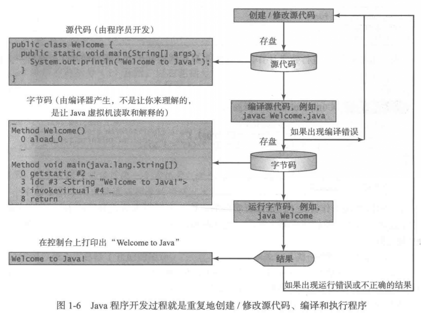
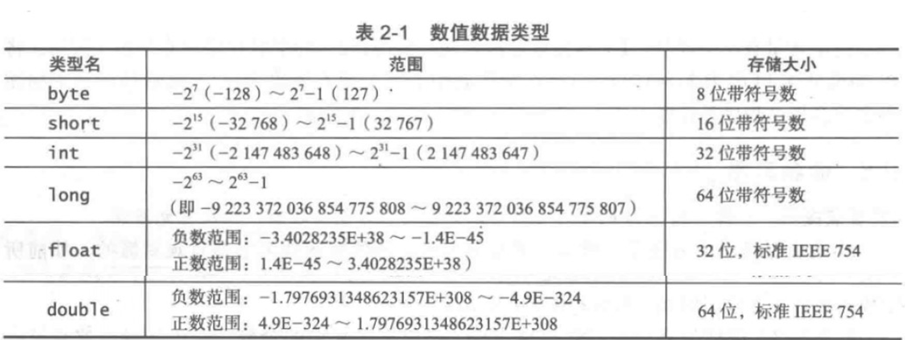
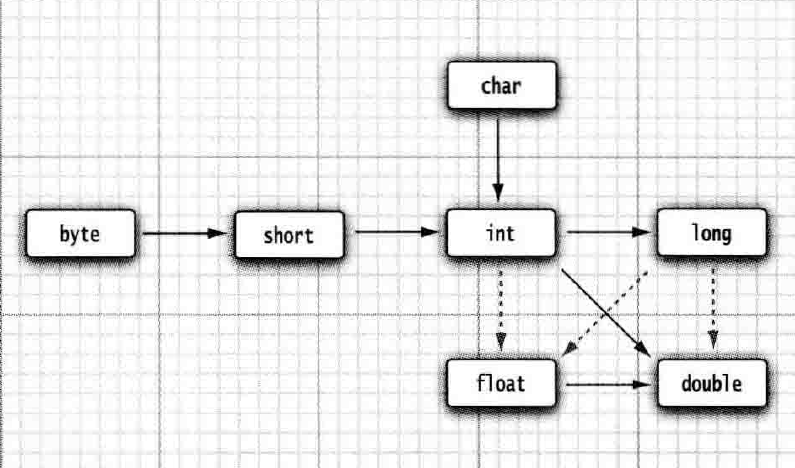

## Java 程序设计语言基础

### 简单说说 JAVA

Java 最初由 Sun 公司开发，后来 Sun 公司被 Oracle 收购了，由于 Java 的优良特性，很快便流行起来。

Java 有以下 11 点好处：

1. 简单性：阉割了 C++ 许多容易带来麻烦的特性，包括指针运算、头文件、结构、联合、操作符重载、虚基类等；
2. 面向对象
3. 分布式：丰富的网络对象处理例程库；
4. 健壮性：强大的编译器能够检测出很多其他编译器检测不出来的错误；
5. 安全性：基于虚拟机运行的沙箱环境拥有良好的安全模型；
6. 体系结构中立：为虚拟机设计的字节码，拥有相对中立的文件格式；
7. 可移植性：精心设计的字节码搭配 JVM 虚拟机，数据类型边界唯一格式统一，拥有优秀的可移植性；
8. 解释性：即探索性开发，这一点在 Python 等纯解释型语言上可以充分体验到，而 JAVA 的开发环境重点不在这种体验上；
9. 高性能：具备热点代码自优化能力的即时编译器，具备高性能；
10. 多线程
11. 动态性：将代码添加到运行中的程序中，而不影响系统运行；

### 关于 OpenJDK 和 OracleJDK

OpenJDK 基于 Sun 公司捐赠的 HotSpot 源代码构建，是一个参考模型，是完全开源的。
OracleJDK 的构建实现过程就是基于 OpenJDK 的，并不是完全开源的。

### 先验知识

#### Java 语言规范、API、JDK、IDE

- Java 语言规范就是 Java 的语法，完整的定义在 https://docs.oracle.com/javase/specs/ 中可以找到；
- API(Application Program Interface) 也称为 *库* ，包括开发 Java 程序预定义的类和接口；
- JDK(Java Development Toolkit)，Java 开发工具包，每个版本都有对应的 Java 开发工具包， Java SE 8 的工具包为 JDK 1.8 = Java 8 = JDK 8
- IDE(Integrated Development Environment) 集成开发环境，将程序的编辑、编译、链接、调试都放在一个界面中。IDE 没有出现的时候，程序员需要使用专门的文本编辑软件编写源代码，然后使用命令行工具调用 JDK 中的Java 开发工具，比如编译器、链接器等，生成调试文件，使用 JDK 中的调试器来查看结果；

Java 的三个版本：

- Java SE，Java 标准版，用于客户端开发；
- Java EE，Java 企业版，用于服务器端开发；
- Java ME，Java 微型版，用于移动开发；

#### 创建、编译和执行 Java 程序

- `.java` 文件存放源代码；
- `.class` 文件为编译生成字节码文件，由 JVM(Java Virtual machine) 执行；

  

#### 一个简单的例子

``` JAVA
// Welcome.java
public class Welcome {
	public static void main(String[] args) {
		System.out.println("Welcome to Java!");
	}
}
```

通过命令行调用 jdk **编译器**生成字节码文件（可执行文件、`.class` 文件），通过 JVM 执行。

``` BASH
#cmd
javac Welcome.java
java Welcome
# Welcome to Java!
```

在执行一个 Java 程序时， JVM 首先使用 *类加载器（class loader）* 将字节码载入到内存中，每个类在使用之前都需要被动态地载入到内存中。类被加载进内存之后， JVM 会使用 *字节码验证器（bytecode verifier）* 对字节码进行验证，以保证程序符合安全规范不会篡改或者危害计算机。随后通过**解释器**逐行执行。后来引进了运行时编译器—— JIT 编译器，将热点代码的机器码在第一次编译时就保存下来，重复执行。改善了解释器在解释热点代码时效率低的问题。

这种**解释与编译共存**的方式是 JAVA 的特点。 JVM 的存在也是 JAVA 语言“一次编译到处运行”的关键。

> jdk 9 引入了 AOT(Ahead of Time Compilation) ，直接将字节码编译成机器码，避免了 JIT 的预热等开销。

#### 代码规范

规范的注释：

``` JAVA
// 行注释风格
/**
块注释风格
**/
```

两种块代码风格：

``` JAVA
// 次行风格 next-line style
public static void main(String[] args) {
	...
}
```

``` JAVA
// 行尾风格 end-of-line style
public static void main(String[] args) 
{
	...
}
```

两种风格选哪种都可以，就是要统一，不要造成代码混乱。

#### 三种程序错误

- 语法错误：缺少必要的关键字、符号或者顺序出错之类的；
- 运行时错误：程序因非正常原因终止，称为运行时错误，比如除 0 错误，内存溢出等等；
- 逻辑错误：没有按照预期输出想要的结果，比较难以察觉；

### 基本程序设计

#### 合法的标识符、命名习惯

- 标识符是由字母、数字、下划线（-) 和美元符号（$) 构成的字符序列。
- 标识符必须以字母、下划线（_)或美元符号（$) 开头，不能以数字开头。
- 标识符不能是保留字（参见 [保留字列表](https://blog.csdn.net/weixin_42614447/article/details/87883920)）。
- 标识符不能是 `true` 、 `false` 或 `null`。
- 标识符可以为任意长度。

标识符的命名规范：

- 驼峰法：`thisIsMethod`、`ThisIsClass`
	- 大驼峰：首字母大写，一般是类或接口
	- 小驼峰：首字母小写，一般是方法或变量
- 全大写：一般是常量，多单词用 `_` 连接
- 包名：可以用 `.` 连接大包到小包

定义一个常量：

``` JAVA
final double PI = 3.14159; // Declare a constant
```

定义一个变量：

``` JAVA
double height = 1.7;
int age = 18;
String name = "John";

int i, j;
i = 0;
j = 1;

int row = 0, column = 1;
```

#### 数据类型和运算操作

Java 是一种强类型语言，每一个变量必须声明一种类型。

Java 拥有 4 种整型(`int` `short` `long` `byte`)、 2 种浮点型(`double` `float`)、 1 种 Unicode 编码的字符类型(`char`)和一种表示真值的布尔型(`boolean`)。

Java 中主要的数值变量类型：
  

`+`、`-`、`*`、`/`、`%` 五种种运算以为还有布尔运算（逻辑运算）`&` 和 `&&` 、`|` 和 `||` 、`!`

输入/输出的简单代码：

``` JAVA
// 初始化键盘输入扫描类
Scanner input = new Scanner(System.in);
// 输出
System.out.print("Enter a byte value: ");

// 读取一个 byte 类型的值
byte byteValue = input.nextByte();
// 读取一个 short 类型的值
short shortValue = input.nextShort();
// 读取一个 int 类型的值
int intValue = input.nextInt();
// 读取一个 long 类型的值
long longValue = input.nextLong();
// 读取一个 float 类型的值
float floatValue = input.nextFloat();
```

#### 整型直接量

直接量就是单纯的数字，不带任何标识符的；

``` JAVA
System.out.println(425342432143214L) // long int
System.out.println(0B111111) // binary int
System.out.println(0777777) // Octal int
System.out.println(0XFFFFFF) // hex int
```

#### 浮点数

- 单精度：`float`
- 双精度：`double`

科学计数法：`5.52604E+1`

遵循 IEEE 754 规范，

- 正无穷：`Double.POSITIVE_INFINITY` ，正数除以 0 得到，可用 `Double.isInfinite(x)` 判断；
- 负无穷：`Double.NEGATIVE_INFINITY` ，负数除以 0 得到，可用`Double.isInfinite(x)` 判断；
- NaN：`Double.NaN`，`0.0/0.0` 得到，可用 `Double.isNaN(x)` 判断；

##### 程序实例：显示当前时间

``` JAVA
public class ShowCurrentTime {
	public static void main(String[] args) {
        long totalMilliseconds = System.currentTimeMillis();

        long totalSeconds = totalMilliseconds / 1000;
        long currentSecond = totalSeconds % 60;

        long totalMinutes = totalSeconds / 60;
        long currentMinute = totalMinutes % 60;

        long totalHours = totalMinutes / 60;
        long currentHour = totalHours % 24;

        System.out.println("Current time is " + currentHour + ":" + currentMinute + ":" + currentSecond + " GMT");
	}
}
```

这个时间戳是从现在到格林威治时间 1970-01-01 的毫秒数，是跟时区有关的。

浮点计算会发生舍入误差，比如命令 `System.out.println(2.0-1.1)` 会打印出 `0.8999999999999999` 这是由于二进制导致的；在不容许舍入误差的场景，应该使用 `BigDecimal` 类。

#### 字符型

Java 中用 `char` 类型代表 UTF-16 中的一个代码单元。

在 Unicode 标准中，一个字符使用两个字节表示，如 `U+0041` 代表了 `A` 。但随着越来越多的语种加入 Unicode 标准，位数超过了 16 位。Java 使用两个 8 位的代码单元表示一个码点超过 16 位的字符。

除非一定要处理 UTF-6 ，否则最好不要使用 `char` 。

#### 字符串

##### 裁剪

`String.substring(start, destination)` 方法用于裁剪字符串，生成一个子串。

##### 拼接

Java 使用 `+` 拼接字符串，不会改变原有的字符串。

##### 字符串不可变

Java 的 `String` 类对象是*不可变字符串*，我们可以修改字符串的引用，指向不同对象，但不可以修改字符串本身。这样看起来是低效的，但由于编译器的 *共享* 机制，使得程序无需因为重复的字符串对象浪费资源。引用可以有很多个，本源只能有一个。

字符串处理有三个相关的类：`String` ， `StringBuilder` ， `StringBuffer`

- `String` ：不可变类型，注意区分 `null` 和空串；
- `StringBuilder` ：使用 `StringBuilder` 对象，通过 `append(str)` 连接字符串，然后通过 `this.toString()` 将字符串构建出来。不是线程安全的，应该限制在单线程使用；
- `StringBuffer` ：作用与 `StringBuilder` 类相同，是 `StringBuilder` 的前身，是线程安全的，可以多线程使用，但性能不够 `StringBuilder` 高；

#### 枚举类型

枚举类 `enum` 用来将变量限制在一个范围内，除了范围内的类型和 `null` 以外，其他取值都是非法的，这种方式用来写一些状态列表可以避免很多错误。

``` JAVA
// 声明枚举类
enum Size {SMALL, MEDIUM, LARGE, EXTRA_LARGE};

// 使用枚举类
Size s = Size.MEDIUM;
```

更详细的内容，在讲完面向对象之后会介绍到。

#### 变量

没什么特别的，就是变量未声明禁止使用。

#### 常量

Java 利用 `final` 指示常量，只能被赋值一次。一旦被赋值之后， 就不能够再更改了。

#### 范围限定符

类限定符：从类的层面上进行限定。

- `public`，其他类可调用；
- `protect`，
- `private`，

- `static`，标识为静态的，指的都是类本身的属性或者方法，无需实例化即可使用；

#### 代码块

#### 数学函数与常量

- `Math.sqrt(x)`，平方根
- `Math.pow(x)`，幂
- `Math.floormod(x, y)`，用于解决 Java 设计中，`-1 % 2 = -1` 的问题；

常用三角函数：

- `Math.sin`
- `Math.cos`
- `Math.tan`
- `Math.atan`
- `Math.atan2`

指数函数和对数函数：

- `Math.exp`
- `Math.log`
- `Math.logl0`

数学常量：

- `Math.PI`
- `Math.E`

#### 显式类型转换和隐式类型转换

隐式类型转换无需声明，在编写表达式或者赋值时就会自动转换。

合法的**隐式数值**类型转换：

  

实线代表不会丢失精度，虚线代表会丢失精度。
> 这里的精度是从二进制的角度进行理解的，由于 `double` 的整数位数比 `long` 要短，所以会使得整数位数中的低位变成零，从而产生精度丢失的问题。

显式类型转换需要在语句中声明，这种方式也可能丢失精度，比如从 `double` 转换成 `int`。

``` JAVA
double x = 9.997;
int y = (int)x; // 9，精度丢失方式是直接截断小数位数
```

> `Math` 库提供了更多的方式进行小数转换，比如 `Math.round()` 方法可以返回最接近的整数。（但返回值为 `long` 用 `int` 来接收还是会产生精度丢失的问题。）

每次进行类型转换不得不考虑的问题就是转换双方的数据范围差别，以及程序可能出现的值，做好边界检查。

#### 位运算符

`&(and) |(or) ^(xor) ~(not) >> << >>>`

注意，没有 `<<<` ，`>> <<` 使用的是循环位移的方案。

#### 输入输出

##### 控制台输入

使用 `Scanner` 类进行输入；

``` JAVA
// 创建输入对象
Scanner input = new Scanner(System.in);
// 接受一个整数
int a = input.nextInt();
// 接受一行输入作为字符串
String s = input.nextLine();
// 读取一个单词，空格作为分隔符
String str = input.next();
// 读取什么类型的数据，就 next 什么
...

// 另外还有判断有无下一个输入的方法
boolean isNextInt = input.hasNextInt();
...
```

为了提供更好的交互性，Java 提供了 `Console` 对象进行更多的交互；

``` JAVA
Console cons = System.console();
String username = cons.readLine("User name: ");
// 这样使用，用户输入密码时不会显示出来
char[] password = cons.readPassword("Password: ");
// 用 char[] 接收密码之后，处理完了要用别的数据填充 char[] 覆盖用户输入的密码
```

##### 格式化输出


#### 泛型

这个特性使得我们可以将类型参数化，即，将类型定义为参数传入方法中，不需要在传入参数的时候再考虑传入对象类型问题，以及相关的程序调试问题。  

借助于**自动打包 (autoboxing)**的java特性，支持泛型类在被调用的时候自动进行类型转换成为调用者指定的类型。  

``` java
//这是一个泛型类
public class genericClass<T> {
	//这是一个泛型方法
	public genericMethod(T param) {...}
	...
}

//这是一个泛型接口
public interface genericInterface<T> {
...}
```


