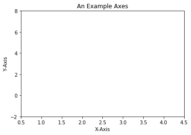
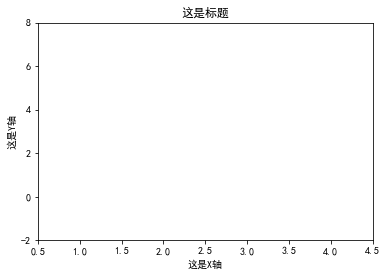
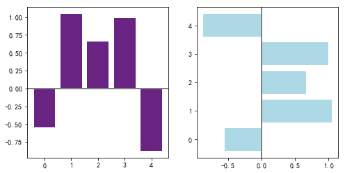
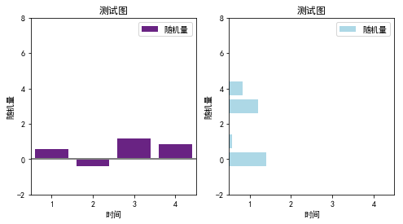

## python-matplotlib绘图

``` Python
import matplotlib.pyplot as plt

fig = plt.figure()

ax = fig.add_subplot(1,1,1)
ax.set(xlim=[0.5, 4.5], ylim=[-2, 8], title='An Example Axes', ylabel='Y-Axis', xlabel='X-Axis')
plt.show()
```

效果如下：

  

若要正常显示中文，则添加如下代码：

``` Python
plt.rcParams['font.sans-serif']=['SimHei'] #用来正常显示中文标签
plt.rcParams['axes.unicode_minus']=False #用来正常显示负号
```

``` Python
fig = plt.figure()

ax = fig.add_subplot(1,1,1)
ax.set(xlim=[0.5, 4.5], ylim=[-2, 8], title='这是标题', ylabel='这是Y轴', xlabel='这是X轴')
plt.show()
```

效果如下：

  

### 直方图

``` Python
np.random.seed(int(time.time()))
x = np.arange(5)
y = np.random.randn(5)
y
fig, axes = plt.subplots(ncols=2, figsize=plt.figaspect(1./2))

# rgb 方式上色，(105, 35, 131)/255
vert_bars = axes[0].bar(x, y, color=(0.411765, 0.137255, 0.513725), align='center')
horiz_bars = axes[1].barh(x, y, color='lightblue', align='center')
#在水平或者垂直方向上画线
axes[0].axhline(0, color='gray', linewidth=2)
axes[1].axvline(0, color='gray', linewidth=2)
plt.show()
```

效果如下：

  

加上图例和坐标轴：

``` Python
np.random.seed(int(time.time()))
x = np.arange(5)
y = np.random.randn(5)
y
fig, axes = plt.subplots(ncols=2, figsize=plt.figaspect(1./2))

# 添加坐标轴信息
axes[0].set(xlim=[0.5, 4.5], ylim=[-2, 8], title='测试图', ylabel='随机量', xlabel='时间')
axes[1].set(xlim=[0.5, 4.5], ylim=[-2, 8], title='测试图', ylabel='随机量', xlabel='时间')

# rgb 方式上色，(105, 35, 131)/255
vert_bars = axes[0].bar(x, y, color=(0.411765, 0.137255, 0.513725), align='center', label='随机量')
horiz_bars = axes[1].barh(x, y, color='lightblue', align='center', label='随机量')

# 应用图例
axes[0].legend()
axes[1].legend()

#在水平或者垂直方向上画线
axes[0].axhline(0, color='gray', linewidth=2)
axes[1].axvline(0, color='gray', linewidth=2)
plt.show()
```

效果如下：

  
